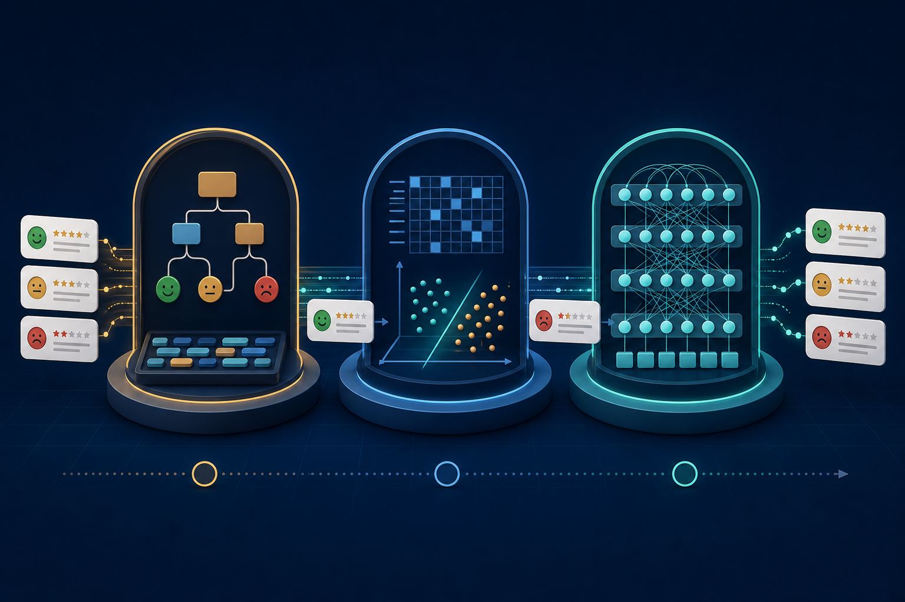

The coding projects turn each major course idea into a working system. Starter code provides the infrastructure so that students can focus on the small number of implementations that matter most.

:::{.project-grid}

:::{.project-card}
[{.project-preview}](projects/01-nlp-time-machine/index.qmd)

:::{.project-card-body}
:::{.project-number}
PROJECT 01 · TWO WEEKS
:::

### [The NLP Time Machine](projects/01-nlp-time-machine/index.qmd)

Implement meaningful pieces of rules, statistical learning, and pretrained Transformer inference in one guided notebook—then explain what each breakthrough changed.

`Text processing`{.project-tag} `Classification`{.project-tag} `Error analysis`{.project-tag}
:::
:::

:::{.project-card.project-card-placeholder}
:::{.project-placeholder-visual}
02
:::

:::{.project-card-body}
:::{.project-number}
PROJECT 02
:::

### Coming next

The second two-week coding project will connect learned embeddings and statistical NLP across Weeks 3–4.
:::
:::

:::
