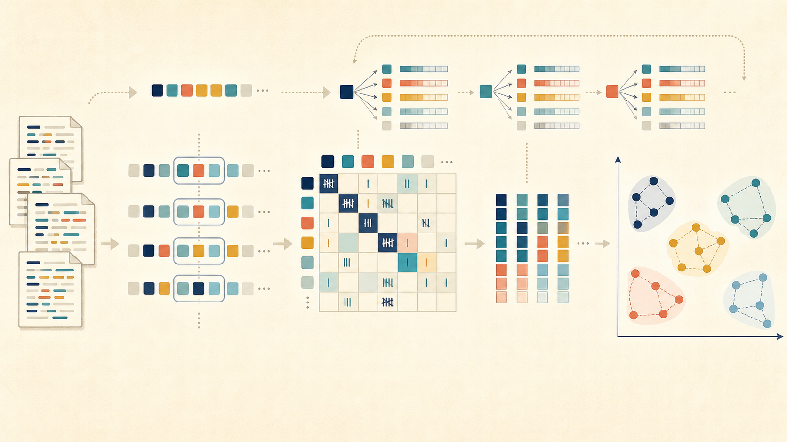
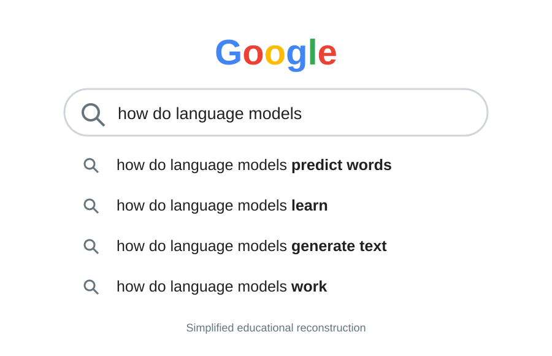

## From corpus evidence to word vectors {.overview-slide}

{.overview-image fig-alt="A corpus becomes token sequences, context windows, a co-occurrence matrix, compact vectors, and geometric word clusters"}

::::: {.journey-labels}
::: {.journey-label}
**CORPUS**

Observe language
:::

::: {.journey-label}
**SEQUENCES**

Count neighbors
:::

::: {.journey-label}
**CONTEXTS**

Collect company
:::

::: {.journey-label}
**MATRIX**

Organize counts
:::

::: {.journey-label}
**VECTORS**

Compress structure
:::
:::::

::: {.notes}
Use the image as the map for the lecture. Trace the lower path from documents to context windows, matrix, and vectors. Then point to the upper path: the same corpus can also estimate what token comes next. Do not explain the algorithms yet. 2 minutes.
:::

## What we will cover

::: {.toc-route}
<div><b>1</b><strong>PREDICT</strong><span>What is a language model?</span></div>
<div><b>2</b><strong>COUNT</strong><span>Build a bigram model</span></div>
<div><b>3</b><strong>GENERATE</strong><span>Choose the next word</span></div>
<div><b>4</b><strong>HANDLE ZEROS</strong><span>Meet unseen sequences</span></div>
<div><b>5</b><strong>EVALUATE</strong><span>Measure perplexity</span></div>
<div><b>6</b><strong>LOOK AHEAD</strong><span>Why we need RNNs</span></div>
:::

<div class="citation">Lecture sequence adapted from [@jurafsky2026slp, Ch. 3].</div>

# Part I · What does a language model predict? {.section-slide}

## The task: complete the sequence

::: {.prediction-stage}
<div class="prediction-history">the students opened their</div>
<div class="prediction-slot">?</div>
:::

::: {.candidate-grid}
<div class="fragment"><span>books</span></div>
<div class="fragment"><span>laptops</span></div>
<div class="fragment"><span>exams</span></div>
<div class="fragment"><span>umbrella</span></div>
:::

::: {.takeaway}
The model does not retrieve one memorized answer—it scores the possible next tokens.
:::

<div class="citation">Next-word prediction framing: [@jurafsky2026slp, Ch. 3].</div>

## You use language models every day

:::: {.everyday-lm-examples}
::: {.everyday-lm-card}
{fig-alt="Google-style search box predicting completions for the query how do language models"}

**SEARCH AUTOCOMPLETE**

Predicts a likely continuation of a partial query.
:::

::: {.everyday-lm-card .phone-card}
{fig-alt="Phone keyboard suggesting books, laptops, and exams after the students opened their"}

**PREDICTIVE TYPING**

Offers likely next words while a sentence is being written.
:::
::::

::: {.fragment .takeaway}
Both interfaces rank possible continuations from the context already entered.
:::

<div class="citation">Illustrations are original educational reconstructions; language-model applications follow [@jurafsky2026slp, Ch. 3].</div>

## A language model distributes probability

::: {.continuation-prompt}
<span>students study</span><b>…</b>
:::

::: {.continuation-bars}
<div class="fragment"><span>language</span><i style="--bar: 100%"></i><b>0.40</b></div>
<div class="fragment"><span>statistics</span><i style="--bar: 75%"></i><b>0.30</b></div>
<div class="fragment"><span>together</span><i style="--bar: 37.5%"></i><b>0.15</b></div>
<div class="fragment"><span>other tokens</span><i style="--bar: 37.5%"></i><b>0.15</b></div>
:::

::: {.probability-total}
<span>probability across all possible next tokens</span><b>Σ = 1.00</b>
:::

::: {.fragment .takeaway}
A language model assigns a probability distribution to the next token—and therefore a probability to a complete sequence.
:::

<div class="citation">Definition and conditional next-token formulation: [@jurafsky2026slp, Ch. 3].</div>

## Prediction turns scores into an action

::: {.prediction-network}
<svg class="branch-map" viewBox="0 0 1200 500" aria-hidden="true">
  <path d="M300 250 C500 250 720 62 1050 62" />
  <path d="M300 250 C500 250 720 188 1050 188" />
  <path d="M300 250 C500 250 720 312 1050 312" />
  <path d="M300 250 C500 250 720 438 1050 438" />
</svg>

<div class="history-node"><small>HISTORY</small><strong>students study</strong><span>$h$</span></div>
<div class="branch-hub"><span>$P(w\mid h)$</span></div>

<div class="candidate-node candidate-language"><span>language</span><b>0.40</b></div>
<div class="candidate-node candidate-statistics"><span>statistics</span><b>0.30</b></div>
<div class="candidate-node candidate-together"><span>together</span><b>0.15</b></div>
<div class="candidate-node candidate-other"><span>other</span><b>0.15</b></div>

<div class="fragment fade-in-then-out greedy-animation">
  <svg viewBox="0 0 1200 500" aria-hidden="true"><path d="M300 250 C500 250 720 62 1050 62" /></svg>
  <div class="greedy-label"><small>GREEDY · ARGMAX</small><b>language</b><span>largest probability = 0.40</span></div>
  <div class="greedy-target-ring"></div>
  <div class="decision-principle greedy-principle"><b>GREEDY PREDICTION</b><span>choose $\arg\max_w P(w\mid h)$</span><strong>→ always selects `language`</strong></div>
</div>

<div class="fragment sampling-animation">
  <svg viewBox="0 0 1200 500" aria-hidden="true"><path d="M300 250 C500 250 720 188 1050 188" /></svg>
  <div class="sampling-label"><small>SAMPLE</small><b>$r=0.58$</b><span>$r\in[0.40,0.70)$ → statistics</span></div>
  <div class="sampling-target-ring"></div>
  <div class="decision-principle sampling-principle">
<div class="random-rule"><b>RANDOM SAMPLING</b><span>draw $r\sim\operatorname{Uniform}[0,1]$</span></div>
<div class="sampling-intervals"><span class="interval-language">language<br><small>[0.00, 0.40)</small></span><span class="interval-statistics">statistics<br><small>[0.40, 0.70)</small></span><span class="interval-together">together<br><small>[0.70, 0.85)</small></span><span class="interval-other">other<br><small>[0.85, 1.00]</small></span><i>r = 0.58 ↓</i></div>
<strong>$r$ falls inside the `statistics` interval → select `statistics`</strong>
  </div>
</div>
:::

<div class="citation">Greedy decoding selects $\arg\max_w P(w\mid h)$; sampling draws according to the full categorical distribution [@jurafsky2026slp, Ch. 3].</div>

## What to keep from Part I

::: {.part-summary .prediction-summary}
<div class="fragment"><b>1</b><span>A language model receives a token history.</span></div>
<div class="fragment"><b>2</b><span>It assigns a probability to every candidate next token.</span></div>
<div class="fragment"><b>3</b><span>Prediction can select the maximum or sample from the distribution.</span></div>
:::

::: {.fragment .next-part}
**NEXT · BUILD THE MODEL**

Where do those probabilities come from if all we have is a small corpus?
:::

<div class="citation">Summary based on [@jurafsky2026slp, Ch. 3].</div>

# Part II · Build a bigram model {.section-slide}

## A sentence is a sequence of decisions

::: {.token-chain}
<span class="fragment">students</span><i class="fragment">→</i><span class="fragment">study</span><i class="fragment">→</i><span class="fragment">language</span><i class="fragment">→</i><span class="fragment">&lt;/s&gt;</span>
:::

::: {.chain-probability}
$$
P(w_{1:T})=\prod_{t=1}^{T}P(w_t\mid w_1,\ldots,w_{t-1})
$$
:::

::: {.history-cards}
<div><b>students</b><span>given sentence start</span></div>
<div><b>study</b><span>given students</span></div>
<div><b>language</b><span>given students study</span></div>
:::

::: {.fragment .takeaway}
The chain rule is exact; the difficulty is estimating a probability for every possible history.
:::

<div class="citation">Chain rule for sequence probabilities: [@jurafsky2026slp, Ch. 3].</div>

## Full histories almost never repeat

:::: {.history-contrast}
::: {.history-panel .long-history}
**Exact history**

`after the morning lecture the students study → ?`

Count in a modest corpus: **0**
:::

::: {.history-panel .short-history}
**Short local history**

`students study → ?`

Count in the same corpus: **many**
:::
::::

::: {.markov-illustration .bigram-focus}
<div class="remote-history fragment"><span>w₁</span><i>→</i><span>…</span><i>→</i><span>wₜ₋₂</span></div>
<i class="blocked-arrow fragment">╳</i>
<div class="local-blanket fragment"><small>BIGRAM HISTORY</small><span>wₜ₋₁</span></div>
<i class="active-arrow fragment">→</i>
<div class="predicted-node"><small>PREDICT</small><b>wₜ</b></div>
:::

::: {.markov-box}
The bigram approximation keeps only the immediately preceding token:

$$P(w_t\mid w_{1:t-1})\approx P(w_t\mid w_{t-1})$$
:::

<div class="citation">The Markov approximation and bigram model: [@jurafsky2026slp, Ch. 3].</div>

## The order controls the memory

::: {.ngram-orders}
<div class="fragment"><b>UNIGRAM</b><code>P(language)</code><span>no preceding token</span></div>
<div class="fragment"><b>BIGRAM</b><code>P(language | study)</code><span>one-token history</span></div>
<div class="fragment"><b>TRIGRAM</b><code>P(language | students study)</code><span>two-token history</span></div>
:::

::: {.fragment .order-tradeoff}
<div class="accuracy-side"><small>BENEFIT OF MORE CONTEXT</small><b>more specific prediction</b><span>potentially more accurate when the context has enough evidence</span><div class="target-rings"><i></i><i></i><i></i><strong>✓</strong></div></div>
<div class="order-increase"><span>increase $n$</span><b>→</b></div>
<div class="evidence-side"><small>COST OF MORE CONTEXT</small><b>fewer matching observations</b><span>sparser counts make the estimate less reliable</span><div class="observation-dots"><i></i><i></i><i></i><i></i><i></i><i></i><i></i><i></i><i></i><i></i><i></i><i></i></div></div>
:::

<div class="citation">N-gram order and context length: [@jurafsky2026slp, Ch. 3].</div>

## Count one tiny corpus

::: {.ngram-corpus}
<div><b>S1</b><span>&lt;s&gt; students study language &lt;/s&gt;</span></div>
<div><b>S2</b><span>&lt;s&gt; students study statistics &lt;/s&gt;</span></div>
<div><b>S3</b><span>&lt;s&gt; researchers study language &lt;/s&gt;</span></div>
<div><b>S4</b><span>&lt;s&gt; students study language &lt;/s&gt;</span></div>
:::

::: {.fragment .boundary-note}
`<s>` and `</s>` let the model count how sentences begin and end.
:::

<div class="citation">Sentence-boundary symbols in n-gram models: [@jurafsky2026slp, Ch. 3].</div>

## Make the relevant counts visible

:::: {.count-inspection}
::: {.count-column}
**History counts**

| history $h$ | $C(h)$ |
|---|---:|
| `study` | 4 |
| `language` | 3 |
| `statistics` | 1 |
:::

::: {.count-column}
**Continuation counts**

| pair $(h,w)$ | $C(h,w)$ |
|---|---:|
| `study language` | 3 |
| `study statistics` | 1 |
:::
::::

::: {.takeaway}
Every maximum-likelihood estimate will be a continuation count divided by its history count.
:::

<div class="citation">Bigram counts and maximum-likelihood estimation: [@jurafsky2026slp, Ch. 3].</div>

## Relative frequency becomes probability

::: {.mle-rule}
$$
P_{\text{MLE}}(w\mid h)=\frac{C(h,w)}{C(h)}
$$
:::

::: {.mle-ledger}
<div><span>history</span><code>study</code><b>C(study) = 4</b></div>
<div><span>continuation</span><code>language</code><b>C(study, language) = 3</b></div>
<div class="mle-result"><span>estimate</span><code>P(language | study)</code><b>3/4 = 0.75</b></div>
:::

::: {.takeaway}
The estimate says: among observed occurrences of this history, how often did this continuation follow?
:::

<div class="citation">Relative-frequency estimate for n-grams: [@jurafsky2026slp, Ch. 3].</div>

## Your turn: estimate three bigrams {.question-slide}

:::: {.bigram-exercise-layout}
::: {.exercise-corpus-six}
<div><b>S1</b><span>&lt;s&gt; students study language &lt;/s&gt;</span></div>
<div><b>S2</b><span>&lt;s&gt; students study statistics &lt;/s&gt;</span></div>
<div><b>S3</b><span>&lt;s&gt; researchers study language &lt;/s&gt;</span></div>
<div><b>S4</b><span>&lt;s&gt; students learn statistics &lt;/s&gt;</span></div>
<div><b>S5</b><span>&lt;s&gt; researchers study statistics &lt;/s&gt;</span></div>
<div><b>S6</b><span>&lt;s&gt; students study language &lt;/s&gt;</span></div>
:::

::: {.pause-box .three-bigram-pause}
**PAUSE · 3 minutes**

Use $P(w\mid h)=C(h,w)/C(h)$ to estimate:

1. $P(study\mid students)$
2. $P(language\mid study)$
3. $P(statistics\mid study)$

For each estimate, write the two counts before the fraction.
:::
::::

<div class="citation">Exercise uses the maximum-likelihood bigram estimate from [@jurafsky2026slp, Ch. 3].</div>

## Worked solution: recover counts before dividing

::::: {.three-bigram-solutions}
::: {.worked-bigram-card}
**study after students**

<span>$C(students,study)=3$</span>
<span>$C(students)=4$</span>

$$P(study\mid students)=\frac{3}{4}=\mathbf{0.75}$$
:::

::: {.worked-bigram-card .language-solution}
**language after study**

<span>$C(study,language)=3$</span>
<span>$C(study)=5$</span>

$$P(language\mid study)=\frac{3}{5}=\mathbf{0.60}$$
:::

::: {.worked-bigram-card .statistics-solution}
**statistics after study**

<span>$C(study,statistics)=2$</span>
<span>$C(study)=5$</span>

$$P(statistics\mid study)=\frac{2}{5}=\mathbf{0.40}$$
:::
:::::

::: {.takeaway}
For the history `study`, the complete row is visible: $0.60+0.40=1.00$.
:::

<div class="citation">Worked maximum-likelihood estimate: [@jurafsky2026slp, Ch. 3].</div>

## What to keep from Part II

::: {.part-summary .bigram-summary}
<div class="fragment"><b>1</b><span>A bigram model keeps one word of history.</span></div>
<div class="fragment"><b>2</b><span>The corpus supplies history and continuation counts.</span></div>
<div class="fragment"><b>3</b><span>Dividing $C(h,w)$ by $C(h)$ creates a next-word distribution.</span></div>
:::

::: {.fragment .next-part}
**NEXT · GENERATE**

How can we use these probability rows to score, predict, and generate a sequence?
:::

<div class="citation">Summary based on [@jurafsky2026slp, Ch. 3].</div>

# Part III · Predict and generate {.section-slide}

## A probability row is a menu

::: {.generation-history}
<small>CURRENT TOKEN</small><strong>study</strong><i>→</i><span>choose the next token</span>
:::

::: {.probability-strip}
<div class="fragment language-mass"><b>language</b><span>0.75</span></div>
<div class="fragment statistics-mass"><b>statistics</b><span>0.25</span></div>
:::

:::: {.generation-choices}
::: {.fragment .generation-choice}
**GREEDY**

Take the largest region → `language`
:::
::: {.fragment .generation-choice .sample-choice}
**SAMPLE**

Draw according to region size → either word
:::
::::

<div class="citation">Greedy selection and sampling from a language-model distribution: [@jurafsky2026slp, Ch. 3].</div>

## Generation is prediction in a loop

```{=html}
<div class="generation-network" aria-label="Animated generation graph. The token students moves to study, then branches to language with probability 0.75 or statistics with probability 0.25; the selected word loops back as the next state.">
<svg viewBox="0 0 1240 360" role="img">
  <defs>
    <marker id="generation-arrow" viewBox="0 0 10 10" refX="9" refY="5" markerWidth="8" markerHeight="8" orient="auto-start-reverse">
      <path d="M 0 0 L 10 5 L 0 10 z"></path>
    </marker>
    <filter id="token-glow"><feGaussianBlur stdDeviation="4" result="blur"></feGaussianBlur><feMerge><feMergeNode in="blur"></feMergeNode><feMergeNode in="SourceGraphic"></feMergeNode></feMerge></filter>
  </defs>

  <path class="generation-edge main-edge" d="M245 150 H450"></path>
  <path class="generation-edge language-edge" d="M660 150 C750 150 760 82 850 82"></path>
  <path class="generation-edge statistics-edge" d="M660 150 C750 150 760 224 850 224"></path>
  <path class="generation-edge return-edge" d="M1080 224 C1180 224 1175 330 620 330 C340 330 330 275 450 210"></path>

  <g class="generation-node seed-svg-node">
    <circle cx="155" cy="150" r="90"></circle>
    <text class="node-kicker" x="155" y="128">SEED</text>
    <text class="node-word" x="155" y="165">students</text>
  </g>
  <g class="generation-node state-svg-node">
    <circle cx="555" cy="150" r="105"></circle>
    <text class="node-kicker" x="555" y="118">NEXT STATE</text>
    <text class="node-word" x="555" y="158">study</text>
    <text class="node-probability" x="555" y="198">P = 1.00</text>
  </g>
  <g class="generation-node candidate-svg-node language-svg-node">
    <rect x="850" y="30" width="230" height="104" rx="24"></rect>
    <text class="node-word" x="965" y="74">language</text>
    <text class="node-probability" x="965" y="108">0.75</text>
  </g>
  <g class="generation-node candidate-svg-node statistics-svg-node">
    <rect x="850" y="172" width="230" height="104" rx="24"></rect>
    <text class="node-word" x="965" y="216">statistics</text>
    <text class="node-probability" x="965" y="250">0.25</text>
  </g>

  <circle class="travelling-token greedy-token" r="13">
    <animateMotion dur="3.8s" repeatCount="indefinite" path="M155 150 H555 C750 150 760 82 965 82"></animateMotion>
  </circle>
  <circle class="travelling-token sample-token" r="11">
    <animateMotion begin="1.9s" dur="3.8s" repeatCount="indefinite" path="M155 150 H555 C750 150 760 224 965 224"></animateMotion>
  </circle>
  <text class="feedback-label" x="775" y="318">append selection → use it as the next state</text>
</svg>
</div>
```

:::: {.decoding-fork}
::: {.fragment .decoding-branch .greedy-branch}
<small>GREEDY · $argmax$ EACH STEP</small>
<b>students → study → language → &lt;/s&gt;</b>
<span>Run again → the <strong>same sentence</strong></span>
:::
::: {.fragment .decoding-branch .sampling-branch}
<small>SAMPLING · DRAW EACH STEP</small>
<b>students → study → statistics → &lt;/s&gt;</b>
<span>Run again → a <strong>different path is possible</strong></span>
:::
::::

<div class="citation">Autoregressive generation repeatedly feeds a selected token back as context; greedy decoding and sampling induce different output behavior [@jurafsky2026slp, Ch. 3].</div>

## Sampling can take another path

::: {.sampling-demo}
<div class="sampling-context"><small>HISTORY</small><strong>study</strong></div>
<div class="sampling-number-line">
  <div class="language-zone"><span>language</span><b>0.00–0.75</b></div>
  <div class="statistics-zone"><span>statistics</span><b>0.75–1.00</b></div>
  <i class="fragment sample-marker">r = 0.82</i>
</div>
<div class="fragment sampling-result"><small>SELECT</small><strong>statistics</strong></div>
:::

::: {.fragment .alternative-sentence}
`<s> students study statistics </s>`
:::

::: {.takeaway}
Sampling preserves variation: less likely continuations can still be generated.
:::

<div class="citation">Sampling interpretation for a categorical next-token distribution: [@jurafsky2026slp, Ch. 3].</div>

## Your turn: score the generated sentence {.question-slide}

::: {.score-prompt-sentence}
`<s> students study language </s>`
:::

::: {.score-givens}
<div><span>P(students | <code>&lt;s&gt;</code>)</span><b>3/4</b></div>
<div><span>P(study | students)</span><b>3/3</b></div>
<div><span>P(language | study)</span><b>3/4</b></div>
<div><span>P(<code>&lt;/s&gt;</code> | language)</span><b>3/3</b></div>
:::

::: {.pause-box .score-pause}
**PAUSE · 90 seconds**

Compute the sentence probability by multiplying its four transition probabilities.

$$P(\text{students study language})=\;?$$
:::

<div class="citation">Sentence scoring with a bigram language model: [@jurafsky2026slp, Ch. 3].</div>

## Worked solution: multiply the path

::: {.sentence-score}
<div class="fragment"><span>&lt;s&gt; → students</span><b>3/4</b></div>
<i class="fragment">×</i>
<div class="fragment"><span>students → study</span><b>3/3</b></div>
<i class="fragment">×</i>
<div class="fragment"><span>study → language</span><b>3/4</b></div>
<i class="fragment">×</i>
<div class="fragment"><span>language → &lt;/s&gt;</span><b>3/3</b></div>
:::

::: {.score-result}
$$P(\text{students study language})=\frac34\times1\times\frac34\times1=\mathbf{0.5625}$$
:::

::: {.takeaway}
Longer sequences accumulate more factors, so their raw probabilities naturally become smaller.
:::

<div class="citation">Bigram sentence probability as a product of local conditionals: [@jurafsky2026slp, Ch. 3].</div>

## What to keep from Part III

::: {.part-summary .generation-summary}
<div class="fragment"><b>1</b><span>Prediction selects from one conditional probability row.</span></div>
<div class="fragment"><b>2</b><span>Generation feeds each selected token back as the next history.</span></div>
<div class="fragment"><b>3</b><span>A sequence score is the product of its transition probabilities.</span></div>
:::

::: {.fragment .next-part}
**NEXT · HANDLE ZEROS**

What happens when generation requests a transition that the training corpus never contained?
:::

<div class="citation">Summary based on [@jurafsky2026slp, Ch. 3].</div>

# Part IV · Handle unseen sequences {.section-slide}

## Can a plausible clause receive probability zero? {.question-slide}

::: {.zero-clause-example}
<small>CLAUSE TO SCORE</small>
<b>students study language</b>
:::

::: {.fragment .unseen-bigram-focus}
<div class="focus-token">students</div><i>→</i><div class="focus-token unseen-history">study</div><i class="unseen-link">╌╌╌→<small>never observed</small></i><div class="focus-token unseen-word">language</div>
<div class="zero-evidence">$C(study,language)=0$</div>
:::

::: {.fragment .pause-box .zero-pause}
**PAUSE · discuss before revealing the next slide**

1. Under the unsmoothed bigram model, what is the probability of the complete clause?
2. Is this clause genuinely improbable—or merely absent from our finite training corpus?
:::

<div class="citation">The zero-frequency problem for maximum-likelihood n-grams: [@jurafsky2026slp, Ch. 3].</div>

## Smoothing reserves probability for the unseen

::: {.smoothing-bridge}
**UNSEEN $\ne$ IMPOSSIBLE** · A finite corpus can miss a perfectly plausible bigram. Smoothing prevents one missing count from eliminating the whole sentence.
:::

:::: {.smoothing-idea}
::: {.probability-mass .before-smoothing .fragment}
**Maximum likelihood**

<div><span>seen events</span><b>100%</b></div>
<div><span>unseen events</span><b>0%</b></div>
:::

::: {.mass-transfer .fragment}
small redistribution →
:::

::: {.probability-mass .after-smoothing .fragment}
**Smoothed model**

<div><span>seen events</span><b>&lt;100%</b></div>
<div><span>unseen events</span><b>&gt;0%</b></div>
:::
::::

::: {.add-one-rule}
**Teaching example**

$$P_{+1}(w\mid h)=\frac{C(h,w)+1}{C(h)+|V|}$$
:::

::: {.takeaway}
Add-one smoothing makes the idea visible, but it usually redistributes too much mass for word language models.
:::

<div class="citation">Add-one smoothing as a pedagogical introduction: [@jurafsky2026slp, Ch. 3].</div>

## Smoothing turns a sparse probability matrix dense

::::: {.sparsity-transformation}
::: {.sparsity-panel .mle-matrix-panel}
**UNSMOOTHED MLE**

<div class="mini-matrix matrix-header"><i></i><b>language</b><b>statistics</b><b>together</b><b>&lt;/s&gt;</b></div>
<div class="mini-matrix"><b>study</b><span>.60</span><span>.40</span><span class="zero-cell">0</span><span class="zero-cell">0</span></div>
<div class="mini-matrix"><b>learn</b><span>.50</span><span class="zero-cell">0</span><span>.50</span><span class="zero-cell">0</span></div>
<div class="mini-matrix"><b>model</b><span class="zero-cell">0</span><span>.33</span><span class="zero-cell">0</span><span>.67</span></div>

<div class="matrix-density"><strong>6 / 12</strong><span>cells are zero</span></div>
:::

::: {.fragment .mass-redistribution}
<b>redistribute</b><span>a little probability mass</span><i>→</i>
:::

::: {.fragment .sparsity-panel .smoothed-matrix-panel}
**ADD-ONE SMOOTHED**

<div class="mini-matrix matrix-header"><i></i><b>language</b><b>statistics</b><b>together</b><b>&lt;/s&gt;</b></div>
<div class="mini-matrix"><b>study</b><span>.44</span><span>.33</span><span class="new-mass">.11</span><span class="new-mass">.11</span></div>
<div class="mini-matrix"><b>learn</b><span>.33</span><span class="new-mass">.17</span><span>.33</span><span class="new-mass">.17</span></div>
<div class="mini-matrix"><b>model</b><span class="new-mass">.14</span><span>.29</span><span class="new-mass">.14</span><span>.43</span></div>

<div class="matrix-density dense-result"><strong>0 / 12</strong><span>cells are zero</span></div>
:::
:::::

::: {.fragment .matrix-clarification}
The **count matrix stays sparse**. Smoothing makes the derived **probability matrix dense**.
:::

<div class="citation">Smoothing assigns nonzero probability to unseen n-grams, converting zero entries in the estimated probability table into small positive values [@jurafsky2026slp, Ch. 3].</div>

## Your turn: give an unseen bigram probability {.question-slide}

::: {.smoothing-givens}
<div><span>history</span><code>study</code></div>
<div><span>$C(study)$</span><b>4</b></div>
<div><span>$C(study,together)$</span><b>0</b></div>
<div><span>candidate vocabulary $|V|$</span><b>4</b></div>
:::

::: {.candidate-vocabulary}
`V = { language, statistics, together, </s> }`
:::

::: {.pause-box .smoothing-pause}
**PAUSE · 90 seconds**

Using add-one smoothing, compute:

$$P_{+1}(together\mid study)=\frac{C(study,together)+1}{C(study)+|V|}$$
:::

<div class="citation">Exercise applies the add-one estimator presented in [@jurafsky2026slp, Ch. 3].</div>

## Worked solution: zero becomes small, not impossible

::: {.add-one-worked}
<div><span>add one to the unseen count</span><b>$0+1$</b></div>
<div><span>add one for every candidate</span><b>$4+4$</b></div>
<div class="fragment result"><span>smoothed probability</span><b>$\frac{1}{8}=\mathbf{0.125}$</b></div>
:::

::: {.mass-ledger}
<div class="fragment"><span>language</span><b>$(3+1)/8=0.50$</b></div>
<div class="fragment"><span>statistics</span><b>$(1+1)/8=0.25$</b></div>
<div class="fragment"><span>together</span><b>$(0+1)/8=0.125$</b></div>
<div class="fragment"><span>&lt;/s&gt;</span><b>$(0+1)/8=0.125$</b></div>
:::

::: {.takeaway}
The row still sums to one, but probability mass moved from seen events to unseen events.
:::

<div class="citation">Worked add-one calculation; for word-level models, stronger smoothing is usually preferred [@jurafsky2026slp, Ch. 3].</div>

## Back off when detailed evidence is weak

::: {.backoff-staircase}
<div class="fragment"><b>BIGRAM</b><code>P(study | language)</code><span>unseen</span></div>
<i class="fragment">↓ ask a simpler question</i>
<div class="fragment"><b>UNIGRAM</b><code>P(study)</code><span>supported by corpus counts</span></div>
:::

:::: {.backoff-contrast}
::: {.fragment}
**Backoff** uses the shorter history when detailed evidence is missing.
:::
::: {.fragment}
**Interpolation** always combines estimates from several history lengths.
:::
::::

::: {.takeaway}
Backoff chooses a shorter history; interpolation combines estimates from several history lengths.
:::

::: {.paper-link}
[Chen & Goodman, “An Empirical Study of Smoothing Techniques for Language Modeling” (ACL 1996)](https://aclanthology.org/P96-1041/)
:::

## What to keep from Part IV

::: {.part-summary .smoothing-summary}
<div class="fragment"><b>1</b><span>An unseen bigram receives zero maximum-likelihood probability.</span></div>
<div class="fragment"><b>2</b><span>Smoothing reserves some probability mass for unseen transitions.</span></div>
<div class="fragment"><b>3</b><span>Backoff uses a shorter, better-supported history.</span></div>
:::

::: {.fragment .next-part}
**NEXT · EVALUATE**

Once every test sequence can receive a score, how do we compare two language models fairly?
:::

<div class="citation">Summary based on [@jurafsky2026slp, Ch. 3] and [Chen & Goodman (1996)](https://aclanthology.org/P96-1041/).</div>

# Part V · Evaluate with perplexity {.section-slide}

## Evaluate on text the model did not see

::: {.evaluation-path}
<div class="fragment"><b>TRAIN</b><span>estimate counts and probabilities</span></div><i class="fragment">→</i>
<div class="fragment"><b>DEVELOPMENT</b><span>choose settings and smoothing</span></div><i class="fragment">→</i>
<div class="fragment"><b>TEST</b><span>report final performance once</span></div>
:::

::: {.held-out-card}
<small>HELD-OUT TEST SENTENCE</small>

`<s> students learn language </s>`
:::

::: {.takeaway}
Testing on training text measures memory; held-out text measures generalization.
:::

<div class="citation">Train/development/test separation for language-model evaluation: [@jurafsky2026slp, Ch. 3].</div>

## Raw sentence probability favors shorter text

:::: {.length-comparison}
::: {.length-card}
**Two decisions**

$$0.5\times0.5=\mathbf{0.25}$$

`students learn`
:::
::: {.length-card .longer-card}
**Four decisions**

$$0.5\times0.5\times0.5\times0.5=\mathbf{0.0625}$$

`students learn language today`
:::
::::

::: {.fragment .length-question}
Did the longer sentence receive a smaller score because the model was worse—or simply because it required more multiplications?
:::

::: {.takeaway}
Evaluation must normalize for the number of predicted tokens.
:::

<div class="citation">Length normalization motivates cross-entropy and perplexity: [@jurafsky2026slp, Ch. 3].</div>

## Perplexity is average inverse confidence

::: {.perplexity-equation}
$$
\operatorname{PPL}(w_{1:T})=
\left(\prod_{t=1}^{T}P(w_t\mid w_{t-1})\right)^{-1/T}
$$
:::

::: {.perplexity-meaning}
<div class="fragment"><small>HIGH TOKEN PROBABILITIES</small><b>→</b><strong>LOW perplexity</strong><span>less surprise</span></div>
<div class="fragment"><small>LOW TOKEN PROBABILITIES</small><b>→</b><strong>HIGH perplexity</strong><span>more surprise</span></div>
:::

::: {.fragment .effective-choices}
Perplexity of **2** is like facing about **two equally plausible choices** at each prediction step.
:::

<div class="citation">Perplexity definition and interpretation: [@jurafsky2026slp, Ch. 3].</div>

## Your turn: compute perplexity {.question-slide}

::: {.ppl-test-sequence}
`<s> students learn language </s>`
:::

::: {.ppl-givens}
<div><span>P(students | <code>&lt;s&gt;</code>)</span><b>0.50</b></div>
<div><span>P(learn | students)</span><b>0.25</b></div>
<div><span>P(language | learn)</span><b>0.50</b></div>
<div><span>P(<code>&lt;/s&gt;</code> | language)</span><b>1.00</b></div>
:::

::: {.pause-box .ppl-pause}
**PAUSE · 2 minutes**

For these $T=4$ predictions:

1. Multiply the four probabilities to obtain the sequence probability.
2. Compute $\operatorname{PPL}=P(sequence)^{-1/4}$.
:::

<div class="citation">Exercise applies the perplexity definition in [@jurafsky2026slp, Ch. 3].</div>

## Worked solution: normalize the surprise

::: {.ppl-worked}
<div class="fragment"><small>1 · MULTIPLY</small><span>$0.50\times0.25\times0.50\times1.00$</span><b>$=\frac{1}{16}$</b></div>
<div class="fragment"><small>2 · INVERT</small><span>$(\frac{1}{16})^{-1}$</span><b>$=16$</b></div>
<div class="fragment result"><small>3 · FOURTH ROOT</small><span>$16^{1/4}$</span><b>$=\mathbf{2}$</b></div>
:::

::: {.takeaway}
On this test sequence, the model behaves as if it had about two equally likely choices per prediction.
:::

<div class="citation">Worked perplexity calculation following [@jurafsky2026slp, Ch. 3].</div>

## Compare models under identical conditions

:::: {.model-comparison}
::: {.model-result .winner}
**MODEL A**

<span>test perplexity</span><b>2.0</b>

Lower average surprise
:::
::: {.model-result}
**MODEL B**

<span>test perplexity</span><b>3.4</b>

Higher average surprise
:::
::::

::: {.comparison-rules}
<div class="fragment"><b>SAME</b><span>held-out test text</span></div>
<div class="fragment"><b>SAME</b><span>tokenization</span></div>
<div class="fragment"><b>SAME</b><span>vocabulary and unknown-word policy</span></div>
:::

::: {.takeaway}
Lower perplexity is better only when the evaluation conditions are the same.
:::

<div class="citation">Requirements for valid perplexity comparison: [@jurafsky2026slp, Ch. 3].</div>

## Perplexity is useful—but not the final goal

:::: {.metric-lenses}
::: {.metric-lens}
**INTRINSIC**

Perplexity asks how well the model predicts held-out tokens.
:::
::: {.metric-arrow}
→
:::
::: {.metric-lens .task-lens}
**EXTRINSIC**

A task metric asks whether the model improves an application.
:::
::::

::: {.fragment .example-task-metrics}
<span>autocomplete acceptance</span><span>speech-recognition errors</span><span>translation quality</span>
:::

::: {.takeaway}
A lower perplexity is encouraging, but downstream evaluation decides whether the model is useful.
:::

<div class="citation">Intrinsic versus extrinsic language-model evaluation: [@jurafsky2026slp, Ch. 3].</div>

## What to keep from Part V

::: {.part-summary .evaluation-summary}
<div class="fragment"><b>1</b><span>Evaluate generalization on held-out text.</span></div>
<div class="fragment"><b>2</b><span>Perplexity normalizes sequence probability by token count.</span></div>
<div class="fragment"><b>3</b><span>Lower perplexity means less average surprise under matched conditions.</span></div>
:::

::: {.fragment .next-part}
**NEXT · LOOK AHEAD**

Even with smoothing and good perplexity, what can a fixed one-word history never remember?
:::

<div class="citation">Summary based on [@jurafsky2026slp, Ch. 3].</div>

# Part VI · Why n-grams are not enough {.section-slide}

## A bigram remembers exactly one token

::: {.dependency-sentence}
<span class="fragment remote-cue">The <b>keys</b></span>
<span class="fragment faded-token">to</span>
<span class="fragment faded-token">the</span>
<span class="fragment local-token">cabinet</span>
<span class="fragment prediction-gap">___</span>
:::

:::: {.memory-views}
::: {.memory-view .human-view}
**THE SENTENCE TELLS US**

The subject is plural: `keys → are`.
:::
::: {.memory-view .bigram-view}
**THE BIGRAM SEES**

Only `cabinet → ?`; the relevant subject is gone.
:::
::::

::: {.takeaway .danger}
A fixed one-token history cannot represent a dependency that crosses several words.
:::

<div class="citation">Fixed-context limitation of n-gram language models: [@jurafsky2026slp, Ch. 3].</div>

## Increasing n makes the table explode

::: {.table-growth}
<div class="fragment"><small>VOCABULARY</small><b>50,000</b><span>possible tokens</span></div>
<i class="fragment">→</i>
<div class="fragment"><small>BIGRAM TABLE</small><b>2.5 billion</b><span>possible pairs</span></div>
<i class="fragment">→</i>
<div class="fragment"><small>TRIGRAM TABLE</small><b>125 trillion</b><span>possible triples</span></div>
:::

::: {.fragment .sparse-table-illustration}
<div class="seen-cell"></div><div></div><div></div><div></div><div></div><div></div><div></div><div></div><div></div><div></div><div></div><div class="seen-cell"></div><div></div><div></div><div></div><div></div><div></div><div></div><div></div><div></div><div></div><div class="seen-cell"></div><div></div><div></div>
<span>most possible n-grams are never observed</span>
:::

::: {.takeaway}
Longer contexts remember more—but create vastly more sparse parameters.
:::

<div class="citation">Parameter growth and sparsity in higher-order n-grams: [@jurafsky2026slp, Ch. 3].</div>

## Similar words cannot share evidence

::: {.sharing-corpus}
<div><small>SEEN 12 TIMES</small><code>students → study</code><b>✓</b></div>
<div><small>SEEN 9 TIMES</small><code>researchers → study</code><b>✓</b></div>
<div class="fragment unseen-sharing"><small>NEVER SEEN</small><code>pupils → study</code><b>?</b></div>
:::

::: {.fragment .similarity-bridge}
<span>students</span><i>≈</i><span>pupils</span><strong>similar meaning</strong>
<b>but</b>
<span class="count-symbol">C(students, study)</span><i>≠</i><span class="count-symbol">C(pupils, study)</span><strong>separate counts</strong>
:::

::: {.takeaway}
An n-gram table treats every word sequence as a separate symbol, even when words are semantically similar.
:::

<div class="citation">Lack of distributed parameter sharing in count-based n-grams: [@jurafsky2026slp, Chs. 3 and 9].</div>

## What to keep from Part VI

::: {.part-summary .limitations-summary}
<div class="fragment"><b>1</b><span>Fixed n-gram histories cannot carry distant information.</span></div>
<div class="fragment"><b>2</b><span>Higher-order tables grow rapidly and remain sparse.</span></div>
<div class="fragment"><b>3</b><span>Separate symbolic counts cannot share evidence across similar words.</span></div>
:::

::: {.fragment .next-part}
**NEXT LECTURE · RNNs**

What kind of model could carry useful information forward through time?
:::

<div class="citation">Summary based on [@jurafsky2026slp, Chs. 3 and 9].</div>

## The complete journey

::: {.final-lm-journey}
<div class="fragment"><b>1</b><strong>PREDICT</strong><span>distribute probability</span></div>
<i class="fragment">→</i>
<div class="fragment"><b>2</b><strong>COUNT</strong><span>estimate bigrams</span></div>
<i class="fragment">→</i>
<div class="fragment"><b>3</b><strong>GENERATE</strong><span>follow probability rows</span></div>
<i class="fragment">→</i>
<div class="fragment"><b>4</b><strong>SMOOTH</strong><span>handle unseen events</span></div>
<i class="fragment">→</i>
<div class="fragment"><b>5</b><strong>EVALUATE</strong><span>measure perplexity</span></div>
<i class="fragment">→</i>
<div class="fragment"><b>6</b><strong>RETHINK</strong><span>carry a learned state</span></div>
:::

::: {.big-summary}
Language modeling turns a history into a distribution over what comes next.
:::

<div class="citation">Lecture synthesis based on [@jurafsky2026slp, Chs. 3 and 9].</div>

## Applied session: build the model yourself

::: {.lab-pipeline}
<div class="fragment"><b>1</b><span>tokenize a tiny corpus</span></div>
<i class="fragment">→</i>
<div class="fragment"><b>2</b><span>count bigram transitions</span></div>
<i class="fragment">→</i>
<div class="fragment"><b>3</b><span>normalize each row</span></div>
<i class="fragment">→</i>
<div class="fragment"><b>4</b><span>predict or sample</span></div>
:::

::: {.lab-output}
<small>YOU WILL BE ABLE TO ASK</small>

`model.predict_next("study")`

<strong>→ language</strong>
:::

::: {.takeaway}
Every number in the model will be inspectable: tokens, counts, probabilities, predictions, and errors.
:::

<div class="citation">Applied workflow implements the count-based bigram model developed in [@jurafsky2026slp, Ch. 3].</div>

## Next: can a model carry memory through time?

```{=html}
<div class="rnn-suspense" aria-label="An animated unrolled recurrent neural network. Input words enter successive recurrent states, information travels from one state to the next, and each state produces an output.">
<svg viewBox="0 0 1240 520" role="img">
  <defs>
    <marker id="rnn-arrow" viewBox="0 0 10 10" refX="9" refY="5" markerWidth="8" markerHeight="8" orient="auto">
      <path d="M0 0 L10 5 L0 10 z"></path>
    </marker>
    <filter id="rnn-glow"><feGaussianBlur stdDeviation="5" result="blur"></feGaussianBlur><feMerge><feMergeNode in="blur"></feMergeNode><feMergeNode in="SourceGraphic"></feMergeNode></feMerge></filter>
  </defs>

  <path class="rnn-edge hidden-edge" d="M110 250 H1110"></path>
  <path class="rnn-edge input-edge" d="M270 440 V335"></path>
  <path class="rnn-edge input-edge" d="M620 440 V335"></path>
  <path class="rnn-edge input-edge" d="M970 440 V335"></path>
  <path class="rnn-edge output-edge" d="M270 165 V70"></path>
  <path class="rnn-edge output-edge" d="M620 165 V70"></path>
  <path class="rnn-edge output-edge" d="M970 165 V70"></path>

  <g class="rnn-state"><rect x="180" y="165" width="180" height="170" rx="28"></rect><text x="270" y="238">RNN</text><text class="state-label" x="270" y="282">state 1</text></g>
  <g class="rnn-state"><rect x="530" y="165" width="180" height="170" rx="28"></rect><text x="620" y="238">RNN</text><text class="state-label" x="620" y="282">state 2</text></g>
  <g class="rnn-state"><rect x="880" y="165" width="180" height="170" rx="28"></rect><text x="970" y="238">RNN</text><text class="state-label" x="970" y="282">state 3</text></g>

  <g class="rnn-input"><text x="270" y="478">the</text><text x="620" y="478">keys</text><text x="970" y="478">to</text></g>
  <g class="rnn-output"><text x="270" y="38">?</text><text x="620" y="38">?</text><text x="970" y="38">?</text></g>

  <circle class="memory-pulse" r="15"><animateMotion dur="4s" repeatCount="indefinite" path="M110 250 H1110"></animateMotion></circle>
  <circle class="input-pulse" r="10"><animateMotion begin=".5s" dur="2s" repeatCount="indefinite" path="M270 440 V250"></animateMotion></circle>
  <circle class="input-pulse" r="10"><animateMotion begin="1.5s" dur="2s" repeatCount="indefinite" path="M620 440 V250"></animateMotion></circle>
  <circle class="input-pulse" r="10"><animateMotion begin="2.5s" dur="2s" repeatCount="indefinite" path="M970 440 V250"></animateMotion></circle>
</svg>
</div>
```

::: {.fragment .rnn-cliffhanger}
**NEXT LECTURE · RECURRENT NEURAL NETWORKS**

One state, reused through time. But how can it learn what deserves to survive?
:::

<div class="citation">Bridge to recurrent language models: [@jurafsky2026slp, Ch. 9].</div>

```{=comment}
Legacy co-occurrence draft retained in source for later archival review; excluded from this lecture build.

# Part II · Co-occurrence representations {.section-slide}

## Meaning leaves a distributional trace

:::: {.distribution-example}
::: {.distribution-sentence}
<span>drink a cup of</span><b>coffee</b>
<span>brew fresh</span><b>coffee</b>
<span>hot</span><b>coffee</b><span>in the morning</span>
:::

::: {.distribution-sentence}
<span>drink a cup of</span><b>tea</b>
<span>brew fresh</span><b>tea</b>
<span>hot</span><b>tea</b><span>in the morning</span>
:::
::::

::: {.fragment .distribution-principle}
**Distributional hypothesis**

Words used in similar linguistic environments tend to have related meanings.
:::

::: {.paper-link}
[Zellig Harris, “Distributional Structure” (1954)](https://doi.org/10.1080/00437956.1954.11659520)
:::

## Turn “environment” into a counting rule

::: {.window-example}
<span>students</span><span class="context-token">study</span><b class="target-token">language</b><span class="context-token">together</span><span>daily</span>
:::

::: {.window-brace}
<div></div><span>window size = 1</span><div></div>
:::

:::: {.window-roles}
::: {.role-card .target-role}
**Target word**

`language`

The word being represented.
:::

::: {.role-card .context-role}
**Context words**

`study`, `together`

The neighbors supplying evidence.
:::
::::

::: {.fragment .takeaway}
A context definition turns a linguistic intuition into repeatable observations.
:::

## Keep one corpus visible

::: {.cooc-corpus}
<div><b>S1</b><span>students study language</span></div>
<div><b>S2</b><span>researchers study language</span></div>
<div><b>S3</b><span>students learn statistics</span></div>
<div><b>S4</b><span>researchers learn statistics</span></div>
:::

::: {.corpus-vocabulary}
**Vocabulary**

`students` · `researchers` · `study` · `learn` · `language` · `statistics`
:::

::: {.fragment .takeaway}
We will use a symmetric window of one token: immediately left or immediately right.
:::

## Slide the window across a sentence

::: {.sliding-steps}
<div><span class="focus">students</span><span class="neighbor">study</span><span>language</span><b>record students ↔ study</b></div>
<div><span class="neighbor">students</span><span class="focus">study</span><span class="neighbor">language</span><b>record study ↔ both neighbors</b></div>
<div><span>students</span><span class="neighbor">study</span><span class="focus">language</span><b>record language ↔ study</b></div>
:::

::: {.fragment .takeaway}
The same sentence contributes several target–context observations.
:::

## One matrix cell answers one question

::: {.cell-definition}
$$
X_{w,c}=\text{number of times context }c\text{ appears inside the window around target }w
$$
:::

::: {.cell-example}
<div><span>target</span><b>study</b></div>
<i>×</i>
<div><span>context</span><b>language</b></div>
<i>→</i>
<div class="cell-count"><span>corpus count</span><b>2</b></div>
:::

::: {.evidence-lines}
<span>S1: students <b>study language</b></span>
<span>S2: researchers <b>study language</b></span>
:::

## Your turn: fill two cells {.question-slide}

::: {.exercise-corpus}
<span>S1 · students <b>study language</b></span>
<span>S2 · researchers <b>study language</b></span>
<span>S3 · students <b>learn statistics</b></span>
<span>S4 · researchers <b>learn statistics</b></span>
:::

::: {.pause-box}
**PAUSE · 90 seconds**

Using a symmetric window of one token, compute:

1. $X_{study,language}$
2. $X_{study,statistics}$
:::

## Worked solution: count only window neighbors

:::: {.cell-solutions}
::: {.cell-solution .observed-cell}
**study × language**

Appears in S1 and S2.

$$X_{study,language}=\mathbf{2}$$
:::

::: {.cell-solution .missing-cell}
**study × statistics**

Never occur next to each other.

$$X_{study,statistics}=\mathbf{0}$$
:::
::::

::: {.fragment .takeaway}
Zero means “not observed under this context rule,” not “unrelated in every possible sense.”
:::

## Assemble the word–context matrix

::: {.cooc-matrix}
| target ↓ / context → | students | researchers | study | learn | language | statistics |
|---|---:|---:|---:|---:|---:|---:|
| **students** | 0 | 0 | 1 | 1 | 0 | 0 |
| **researchers** | 0 | 0 | 1 | 1 | 0 | 0 |
| **study** | 1 | 1 | 0 | 0 | 2 | 0 |
| **learn** | 1 | 1 | 0 | 0 | 0 | 2 |
| **language** | 0 | 0 | 2 | 0 | 0 | 0 |
| **statistics** | 0 | 0 | 0 | 2 | 0 | 0 |
:::

::: {.fragment .matrix-reading}
Rows are targets, columns are contexts, and each cell is an observable corpus count.
:::

## A row is already a word vector

::: {.row-extraction}
<div class="matrix-row-label">students</div>
<div class="matrix-number zero">0</div><div class="matrix-number zero">0</div><div class="matrix-number">1</div><div class="matrix-number">1</div><div class="matrix-number zero">0</div><div class="matrix-number zero">0</div>
<i>→</i>
<div class="extracted-vector"><code>x_students = [0,0,1,1,0,0]</code></div>
:::

::: {.row-extraction .second-row}
<div class="matrix-row-label">researchers</div>
<div class="matrix-number zero">0</div><div class="matrix-number zero">0</div><div class="matrix-number">1</div><div class="matrix-number">1</div><div class="matrix-number zero">0</div><div class="matrix-number zero">0</div>
<i>→</i>
<div class="extracted-vector"><code>x_researchers = [0,0,1,1,0,0]</code></div>
:::

::: {.fragment .takeaway}
The coordinates have names: each dimension measures association with one context word.
:::

## Similar contexts create similar directions

::: {.cosine-comparison}
<div><b>students</b><code>[0, 0, 1, 1, 0, 0]</code></div>
<div><b>researchers</b><code>[0, 0, 1, 1, 0, 0]</code></div>
:::

::: {.cosine-equation}
$$
\cos(\mathbf{x},\mathbf{y})=
\frac{\mathbf{x}^{\mathsf T}\mathbf{y}}{\lVert\mathbf{x}\rVert\lVert\mathbf{y}\rVert}
=\frac{2}{\sqrt2\sqrt2}=\mathbf{1}
$$
:::

::: {.fragment .takeaway}
In this tiny corpus, the two words are indistinguishable because they have exactly the same observed neighbors.
:::

## Similar does not always mean synonymous

:::: {.similarity-types}
::: {.similarity-card .substitution-card}
**Similar roles**

`students ↔ researchers`

They can occupy comparable positions.
:::

::: {.similarity-card .association-card}
**Strong association**

`study ↔ language`

They frequently occur together but are not synonyms.
:::
::::

::: {.fragment .takeaway}
Distributional similarity captures patterns of use; interpreting those patterns still requires care.
:::

## The context definition changes the geometry

::: {.context-choice-grid}
<div><b>WINDOW ±1</b><span>immediate local behavior</span><code>study ↔ language</code></div>
<div><b>WINDOW ±5</b><span>broader topical association</span><code>lecture ↔ statistics</code></div>
<div><b>LEFT / RIGHT</b><span>word order and grammatical position</span><code>the _ ↔ noun slot</code></div>
<div><b>DEPENDENCY</b><span>syntactic relationships</span><code>drink → object: coffee</code></div>
:::

::: {.fragment .takeaway}
There is no context-free embedding: the counting rule decides which relationships become visible.
:::

## Word–word and word–document matrices answer different questions

:::: {.matrix-types}
::: {.matrix-type .word-context-type}
**Word × context**

Rows summarize nearby words.

Useful for lexical similarity and word representations.
:::

::: {.matrix-type .word-document-type}
**Word × document**

Rows summarize where words occur.

Useful for topical relatedness and information retrieval.
:::
::::

::: {.fragment .takeaway}
The matrix axes define what each coordinate means.
:::

## Raw counts inherit corpus frequency

::: {.frequency-contrast}
<div class="frequent-context"><b>the</b><strong>12,481</strong><span>appears near almost everything</span></div>
<div class="informative-context"><b>syntax</b><strong>184</strong><span>rarer, but more discriminative</span></div>
:::

::: {.fragment .raw-count-problem}
A large count can mean **strong association**, or merely **a very frequent context**.
:::

::: {.fragment .takeaway}
Part III will replace raw frequency with association strength, then compress the sparse matrix.
:::

## Readings for the distributional view

:::: {.reading-cards}
::: {.reading-card}
**The linguistic foundation**

[Harris (1954): Distributional Structure](https://doi.org/10.1080/00437956.1954.11659520)

Develops a description of linguistic elements through their distributions relative to other elements.
:::

::: {.reading-card}
**The computational survey**

[Turney & Pantel (2010): From Frequency to Meaning](https://arxiv.org/abs/1003.1141)

Organizes vector-space semantics around word–context, term–document, and pair–pattern matrices.
:::
::::

## What to keep from Part II

::: {.part-summary}
<div><b>1</b><span>The distributional view represents a word through its observed environments.</span></div>
<div><b>2</b><span>A context window converts each corpus position into target–context observations.</span></div>
<div><b>3</b><span>A co-occurrence matrix stores those observations in named coordinates.</span></div>
<div><b>4</b><span>Matrix rows are sparse word vectors that can be compared geometrically.</span></div>
<div><b>5</b><span>Window and matrix choices determine which relationships the representation exposes.</span></div>
:::

::: {.next-part}
**NEXT · PART III**

Raw counts give us vectors—but frequent contexts dominate and the matrix is enormous.
:::

```
