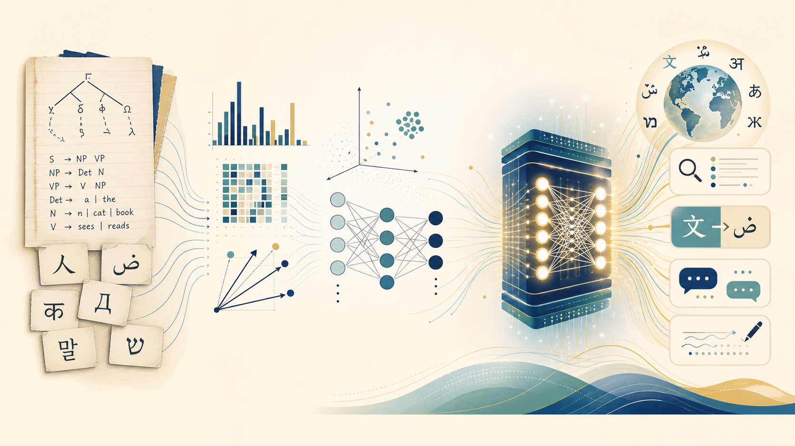

:::{.course-note-masthead .content-visible when-format="html"}


CS 351 · Introduction to Natural Language Processing  
Chapter 1 · Tasks, eras, and breakthroughs
:::

{fig-alt="An illustrated history of NLP moving from grammar rules through statistics and neural networks to multilingual Transformer applications." .chapter-hero}

Natural language processing sits at a remarkable intersection: **human communication**, **computational models**, and **real-world decisions**. This course is about understanding that intersection well enough to build useful systems—and to recognize where those systems succeed, fail, or mislead.

We begin with the map rather than the machinery. Today we will see what NLP systems do, compare three ways of building them, and trace the breakthroughs that produced modern language models. In the next chapter, we will slow down and ask how written language becomes something a model can process.

:::{.callout-note}
## By the end of this session

You should be able to:

1. navigate the course and explain how its lectures, notes, and projects fit together;
2. recognize the major families of NLP tasks;
3. contrast rule-based, statistical, and neural approaches;
4. place Transformers and language models in a longer history of NLP; and
5. explain why tokenization is the necessary next step.
:::

# Your route through the course {#sec-course-route}

The website is the course's home base. Each week begins with a motivating question, develops the underlying ideas, and ends with a system you can run, inspect, and improve.

```{mermaid}
%%| label: fig-course-route
%%| fig-cap: "The weekly learning loop: ideas become experiments, and experiments create better questions."
%%| fig-width: 7.2
flowchart LR
    A[Schedule<br/>where we are] --> B[Lecture<br/>the big idea]
    B --> C[Notes<br/>the durable explanation]
    C --> D[Coding project<br/>build and test]
    D --> E[Error analysis<br/>learn from failure]
    E -. new questions .-> B

    classDef start fill:#f4efe4,stroke:#b48a32,color:#17364a
    classDef learn fill:#e8f2f0,stroke:#0f6f78,color:#17364a
    classDef build fill:#eaf0f5,stroke:#315f7d,color:#17364a
    class A start
    class B,C learn
    class D,E build
```

## Where everything lives

| Website area | Use it for | Your habit |
|---|---|---|
| **Schedule** | The current topic, notes, readings, and project | Start here every week |
| **Lecture** | Motivation, demonstrations, and discussion | Participate and ask questions |
| **Notes** | Explanations, examples, diagrams, and references | Return while implementing |
| **Coding projects** | Focused practice with immediate feedback | Build, test, then analyze errors |
| **Student projects** | Final-project themes, milestones, and presentations | Connect course ideas to a problem you care about |

:::{.callout-important}
## Projects are the center of the course

Knowing the vocabulary is not enough. You will learn NLP by making systems behave, investigating why they fail, and communicating what you discovered.
:::

## Assessment at a glance

The intended balance keeps most of the grade on sustained, reproducible work.

```{mermaid}
%%| label: fig-assessment
%%| fig-cap: "Proposed assessment balance; final percentages will be confirmed on the logistics page."
%%| fig-width: 5.2
pie showData
    title Assessment balance
    "Coding-project portfolio" : 45
    "Final project" : 40
    "Partial examination" : 15
```

The **coding-project portfolio** rewards consistent implementation and reflection. The **final project** asks you to formulate a problem, choose a defensible approach, evaluate it, and present the result. A short **partial examination** checks that you can connect the central ideas without relying on code.

# What can machines do with language? {#sec-tasks}

NLP is not one task. It is a family of problems connected by a shared input or output: human language.

```{mermaid}
%%| label: fig-nlp-task-map
%%| fig-cap: "A task map for NLP. Many real applications combine several branches."
%%| fig-width: 7.5
mindmap
  root((Language))
    Understand
      Classification
      Sentiment
      Information extraction
      Intent detection
    Find
      Search
      Retrieval
      Question answering
    Transform
      Translation
      Summarization
      Simplification
    Generate
      Dialogue
      Writing assistance
      Data-to-text
    Connect
      Speech recognition
      Text to speech
      Multimodal systems
```

## One message, many possible tasks

Consider the message:

> The battery lasts all day, but the camera struggles at night.

Different NLP systems could ask very different questions:

| Task | Possible output |
|---|---|
| Sentiment analysis | Mixed |
| Aspect extraction | `battery`, `camera` |
| Aspect sentiment | Battery: positive; camera: negative |
| Summarization | Good battery, weak low-light camera |
| Translation | The same meaning in another language |
| Retrieval | Products with stronger night photography |
| Dialogue | A follow-up question about the user's priorities |

The text is identical, but the **task determines what information matters**. There is no universally correct representation of language independent of a goal.

```{mermaid}
%%| label: fig-task-lens
%%| fig-cap: "The task acts as a lens: the same language is transformed into different useful outputs."
%%| fig-width: 6.8
flowchart LR
    X[One review] --> A{Task lens}
    A --> B[Label<br/>mixed sentiment]
    A --> C[Entities<br/>battery, camera]
    A --> D[Summary<br/>strength + weakness]
    A --> E[Response<br/>helpful recommendation]

    classDef input fill:#f4efe4,stroke:#b48a32,color:#17364a
    classDef lens fill:#e8f2f0,stroke:#0f6f78,color:#17364a
    classDef output fill:#eaf0f5,stroke:#315f7d,color:#17364a
    class X input
    class A lens
    class B,C,D,E output
```

# One problem, three eras {#sec-three-eras}

Imagine that we must label a product review as positive or negative. The task stays fixed. What changes across NLP history is **where the useful knowledge comes from**.

```{mermaid}
%%| label: fig-three-eras
%%| fig-cap: "Three approaches to the same sentiment-classification problem."
%%| fig-width: 7.6
flowchart TB
    R["Review: The screen is beautiful,<br/>but the battery is not good."]

    R --> A[Rules<br/>write patterns by hand]
    R --> B[Statistical learning<br/>learn weights from examples]
    R --> C[Pretrained Transformer<br/>adapt contextual knowledge]

    A --> A1[lexicon + negation rule]
    B --> B1[word counts + classifier]
    C --> C1[contextual tokens + neural head]

    A1 --> Y[Prediction + explanation]
    B1 --> Y
    C1 --> Y

    classDef source fill:#f4efe4,stroke:#b48a32,color:#17364a
    classDef era fill:#e8f2f0,stroke:#0f6f78,color:#17364a
    classDef detail fill:#f7fafc,stroke:#6d8999,color:#17364a
    classDef result fill:#eaf0f5,stroke:#315f7d,color:#17364a
    class R source
    class A,B,C era
    class A1,B1,C1 detail
    class Y result
```

## Era I · Tell the machine the rules

A rule-based system uses knowledge written explicitly by people:

```text
beautiful  → +1
good       → +1
not good   → reverse the score
```

This approach is transparent and can work well in a narrow domain. Its weakness is coverage: every new expression, exception, and context may require another rule.

## Era II · Learn patterns from examples

A statistical classifier receives labeled reviews and estimates which observable features predict each label. Instead of assigning weights manually, it learns them from data.

```{mermaid}
%%| label: fig-statistical-learning
%%| fig-cap: "The classical statistical-learning recipe."
%%| fig-width: 6.8
flowchart LR
    A[Labeled text] --> B[Feature extraction<br/>counts, n-grams]
    B --> C[Learning algorithm]
    C --> D[Estimated weights]
    E[New text] --> F[Same feature extraction]
    D --> G[Classifier]
    F --> G
    G --> H[Prediction]

    classDef data fill:#f4efe4,stroke:#b48a32,color:#17364a
    classDef process fill:#e8f2f0,stroke:#0f6f78,color:#17364a
    classDef model fill:#eaf0f5,stroke:#315f7d,color:#17364a
    class A,E data
    class B,C,F process
    class D,G,H model
```

Statistical learning scales beyond hand-written rules, but its representation is often shallow. A bag of words knows that *good* occurred; it does not naturally understand why *not good* differs from *good*.

## Era III · Learn representations and reuse knowledge

Neural models learn both the representation and the prediction function. Modern Transformers go further: they first learn from enormous collections of text, then reuse that knowledge for a particular task.

```{mermaid}
%%| label: fig-pretrain-adapt
%%| fig-cap: "Modern NLP separates broad pretraining from task-specific adaptation or prompting."
%%| fig-width: 6.8
flowchart LR
    A[Large text collections] --> B[Pretraining]
    B --> C[General language model]
    C --> D[Fine-tuning]
    C --> E[Prompting]
    C --> F[Retrieval augmentation]
    D --> G[Task system]
    E --> G
    F --> G

    classDef data fill:#f4efe4,stroke:#b48a32,color:#17364a
    classDef learn fill:#e8f2f0,stroke:#0f6f78,color:#17364a
    classDef model fill:#eaf0f5,stroke:#315f7d,color:#17364a
    class A data
    class B,D,E,F learn
    class C,G model
```

The newer method is not automatically the best choice. A small rule system may be cheaper, easier to audit, and more reliable for a stable narrow task. The right question is not “Which era won?” but **which assumptions and trade-offs fit the problem?**

| Question | Rules | Statistical learning | Pretrained Transformers |
|---|---|---|---|
| Where does knowledge come from? | Human experts | Labeled examples | Pretraining data + task data/instructions |
| Representation | Designed by hand | Usually engineered features | Learned contextual representations |
| Data requirement | Low | Moderate labeled dataset | Large pretraining; adaptation can use less labeled data |
| Interpretability | Often high | Often manageable | Usually more difficult |
| Compute cost | Low | Low to moderate | Moderate to very high |
| Typical strength | Control in narrow domains | Strong, efficient baselines | Transfer and broad language capability |

:::{.callout-tip}
## Project 01 · The NLP Time Machine

Your first coding project turns this comparison into an experiment. You will send the same sentiment examples through rules, a statistical classifier, and a pretrained Transformer—then analyze where each system fails.

[Open Project 01](../../projects/01-nlp-time-machine/index.qmd){.btn .btn-primary}
:::

# Breakthroughs that changed the field {#sec-breakthroughs}

NLP did not jump directly from dictionaries to chatbots. Each breakthrough removed one bottleneck and exposed another.

```{mermaid}
%%| label: fig-breakthrough-timeline
%%| fig-cap: "A conceptual timeline of major shifts in NLP. Dates mark influential milestones, not clean boundaries between eras."
%%| fig-width: 8.0
timeline
    title From hand-written knowledge to general-purpose language systems
    1950s–1980s : Rules, grammars, and symbolic systems
    1990s : Corpora and statistical language models
    2000s : Discriminative classifiers and engineered features
    2013 : Distributed word representations at scale
    2014–2016 : Neural sequence models and attention
    2017 : Transformer architecture
    2018–2020 : Large-scale pretraining and transfer
    2021–today : Instruction tuning, tool use, multimodality, and retrieval
```

<!-- IMAGE-SUGGESTION: A licensed archival photograph or screenshot of an early rule-based NLP system such as ELIZA. Search terms: "ELIZA 1966 terminal screenshot public domain". Prefer a museum, university archive, or original paper source. -->

<!-- IMAGE-SUGGESTION: A licensed historical image representing statistical machine translation. Search terms: "IBM statistical machine translation Candide system diagram". Prefer the original IBM research paper or an institutional archive. -->

<!-- IMAGE-SUGGESTION: A clean, licensed visualization accompanying Attention Is All You Need. Search terms: "Transformer architecture original paper figure". Use the paper figure only with appropriate citation and teaching-use permissions. -->

## The recurring pattern

```{mermaid}
%%| label: fig-breakthrough-pattern
%%| fig-cap: "Breakthroughs repeatedly move work from explicit human design into learning, while increasing the importance of data and evaluation."
%%| fig-width: 7.2
flowchart LR
    A[Write rules] -->|learn weights| B[Design features]
    B -->|learn representations| C[Design architectures]
    C -->|pretrain broadly| D[Adapt with data and instructions]
    D -->|connect external knowledge| E[Build language systems]

    A -. human specification decreases .-> E
    E -. data, compute, and evaluation increase .-> A

    classDef old fill:#f4efe4,stroke:#b48a32,color:#17364a
    classDef middle fill:#e8f2f0,stroke:#0f6f78,color:#17364a
    classDef modern fill:#eaf0f5,stroke:#315f7d,color:#17364a
    class A old
    class B,C middle
    class D,E modern
```

### Statistical language models

Counting sequences of words made uncertainty measurable. A model could assign probabilities to sentences, rank alternatives, and generate text—although it struggled with rare phrases and long-range context.

### Distributed representations

Word embeddings replaced isolated symbols with vectors learned from usage. Similar contexts produced nearby representations, giving systems a geometric notion of relatedness.

### Neural sequence models

Recurrent networks processed text in order and learned features jointly with the task. They improved sequence modeling but remained difficult to train over long contexts.

### Attention

Attention allowed a model to focus directly on relevant parts of an input instead of compressing everything into a single fixed-size state.

### Transformers

Transformers made attention the central mechanism and enabled much more parallel training. Their scalability helped make broad pretraining practical [@vaswani2017attention].

### Pretraining and instruction following

A pretrained model can reuse patterns learned from broad text collections. Fine-tuning, prompting, and instruction tuning turn that general model toward specific behaviors.

### Retrieval and tools

Modern systems can search external collections, cite retrieved evidence, call software tools, and combine language with images or audio. The language model becomes one component in a larger system.

:::{.callout-warning}
## Capability is not understanding, and fluency is not evidence

Modern models can produce convincing language while being wrong, biased, outdated, or unsupported. Throughout the course, evaluation and error analysis will matter as much as model architecture.
:::

# The questions that follow us {#sec-questions}

Every module in this course returns to four questions.

```{mermaid}
%%| label: fig-course-questions
%%| fig-cap: "Four questions for analyzing any NLP system."
%%| fig-width: 6.6
flowchart TB
    S((NLP system))
    S --> A[Representation<br/>What can the model see?]
    S --> B[Learning<br/>Where does knowledge come from?]
    S --> C[Evaluation<br/>What does success mean?]
    S --> D[Responsibility<br/>Who benefits or bears risk?]

    classDef center fill:#17364a,stroke:#17364a,color:#ffffff
    classDef question fill:#e8f2f0,stroke:#0f6f78,color:#17364a
    class S center
    class A,B,C,D question
```

These questions prevent us from treating a model as a mysterious object with a single accuracy number. They connect technical design to evidence, cost, users, and consequences.

# Next: how does text enter a model? {#sec-next}

We have spoken casually about giving a model “text.” A computer never receives words or meanings directly. It receives encoded symbols that must be divided into units and mapped to numbers.

Consider these strings:

```text
don't     do not     DON’T
résumé    resume     résumé
مرحبا!    👩🏽‍💻      #NaturalLanguageProcessing
```

Where are the boundaries? Which differences matter? What should remain unchanged? Even counting “characters” is less obvious than it first appears.

```{mermaid}
%%| label: fig-next-chapter
%%| fig-cap: "The next chapter opens the first black box in every NLP pipeline."
%%| fig-width: 7.2
flowchart LR
    A[Human writing<br/>meaning in context] --> B[Encoding<br/>bytes and Unicode]
    B --> C[Normalization<br/>which forms count as equivalent?]
    C --> D[Tokenization<br/>where are the units?]
    D --> E[Identifiers<br/>numbers for a model]
    E --> F[Model]

    classDef human fill:#f4efe4,stroke:#b48a32,color:#17364a
    classDef prep fill:#e8f2f0,stroke:#0f6f78,color:#17364a
    classDef model fill:#eaf0f5,stroke:#315f7d,color:#17364a
    class A human
    class B,C,D,E prep
    class F model
```

:::{.callout-important}
## The question for Chapter 2

Before a model can learn from language, **what exactly does it receive?**
:::

The answer begins with Unicode, normalization, and tokenization.
