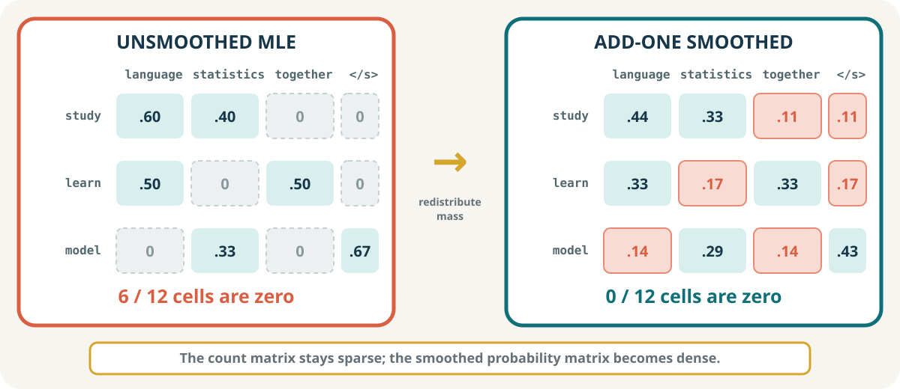

:::{.course-note-masthead .content-visible when-format="html"}


CS 351 · Introduction to Natural Language Processing  
Chapter 4 · Statistical language modeling
:::

When a phone proposes the next word, a search engine completes a query, or a speech recognizer compares possible transcriptions, the system needs a distribution over what may come next. A **language model** supplies that distribution.

This chapter develops the smallest useful language model from first principles. We will keep one corpus visible, inspect every count, and follow the model through prediction, generation, smoothing, and evaluation. Its failures will then create the question that motivates recurrent neural networks.

{#fig-statistical-overview .chapter-overview-image width=82% fig-align="center"}

```{mermaid}
%%| label: fig-chapter-route
%%| fig-cap: "The chapter follows one dependency chain: each stage requires the object constructed by the previous stage."
%%| fig-width: 6.2
flowchart LR
    A[Predict] --> B[Count]
    B --> C[Generate]
    C --> D[Handle zeros]
    D --> E[Evaluate]
    E --> F[Look ahead]

    classDef start fill:#e8f2f0,stroke:#0f6f78,color:#17364a
    classDef middle fill:#fff3d6,stroke:#b98a1d,color:#17364a
    classDef problem fill:#f8e5df,stroke:#d95f43,color:#17364a
    class A,B,C start
    class D,E middle
    class F problem
```

:::{.callout-note}
## Learning objectives

After this chapter, you should be able to:

1. distinguish a language-model distribution from a single prediction;
2. derive unigram, bigram, and general n-gram approximations from the chain rule;
3. construct bigram counts and maximum-likelihood probabilities from a tokenized corpus;
4. explain greedy decoding and probabilistic sampling;
5. calculate the probability and log-probability of a sequence;
6. explain why unseen n-grams produce zero probabilities and how smoothing responds;
7. calculate and interpret perplexity on held-out text; and
8. identify the memory, sparsity, and parameter-sharing limitations that motivate recurrent models.
:::

# Predicting the next word {#sec-predict}

Suppose the visible history is:

> `students study ...`

Several continuations are grammatical, but they are not equally likely. A language model should not return only a word. It should return a **probability distribution**:

| Candidate $w$ | $P(w\mid\text{students study})$ |
|---|---:|
| language | 0.40 |
| statistics | 0.30 |
| together | 0.15 |
| other words | 0.15 |

: A next-word distribution represents both a preferred continuation and the remaining uncertainty. {#tbl-next-word-distribution}

The values in @tbl-next-word-distribution are nonnegative and sum to one. Prediction is a decision made **from** this distribution; the distribution itself is the model output [@jurafsky2026slp, ch. 3].

```{mermaid}
%%| label: fig-prediction-tree
%%| fig-cap: "One history can support several continuations. A decision rule converts the distribution into an action."
%%| fig-width: 6.2
flowchart LR
    H[students study] -->|0.40| L[language]
    H -->|0.30| S[statistics]
    H -->|0.15| T[together]
    H -->|0.15| O[other]

    classDef history fill:#17364a,stroke:#17364a,color:#ffffff
    classDef likely fill:#e8f2f0,stroke:#0f6f78,color:#17364a
    classDef alternative fill:#f8e5df,stroke:#d95f43,color:#17364a
    class H history
    class L likely
    class S,T,O alternative
```

## Greedy choice versus sampling

Two common decision rules use the same distribution differently.

**Greedy decoding** selects the most probable word:

$$
\hat w=\underset{w\in V}{\arg\max}\;P(w\mid h).
$$ {#eq-greedy}

For @tbl-next-word-distribution, greedy decoding always selects *language*.

**Sampling** draws a word according to the entire categorical distribution. One implementation partitions $[0,1)$ into cumulative intervals:

```text
language     [0.00, 0.40)
statistics   [0.40, 0.70)
together     [0.70, 0.85)
other        [0.85, 1.00)
```

If $r=0.58$, the sampled word is *statistics*. Sampling can therefore choose a less likely continuation without pretending it was the most likely one.

:::{.callout-tip}
## Prediction is not generation

**Prediction** performs one next-word decision. **Generation** repeats prediction, appends the selected word, and uses the enlarged sequence as the next history.
:::

# From the chain rule to n-grams {#sec-chain-rule}

A language model assigns a probability to a sequence $w_{1:n}=(w_1,\ldots,w_n)$. Probability theory gives an exact factorization:

$$
P(w_{1:n})=\prod_{t=1}^{n}P(w_t\mid w_{1:t-1}).
$$ {#eq-chain-rule}

For a three-word sentence,

$$
P(w_1,w_2,w_3)
=P(w_1)P(w_2\mid w_1)P(w_3\mid w_1,w_2).
$$

The chain rule is exact. The difficulty is estimating conditionals with long histories: most complete histories appear rarely or never, even in large corpora [@jurafsky2026slp, ch. 3].

## The Markov approximation

An n-gram model deliberately keeps only a fixed suffix of the history:

$$
P(w_t\mid w_{1:t-1})
\approx
P(w_t\mid w_{t-n+1:t-1}).
$$ {#eq-markov-approximation}

| Model | Retained history | Example |
|---|---|---|
| Unigram | none | $P(language)$ |
| Bigram | one token | $P(language\mid study)$ |
| Trigram | two tokens | $P(language\mid students,study)$ |

: Increasing the order retains more context but demands evidence for more specific histories. {#tbl-ngram-orders}

```{mermaid}
%%| label: fig-order-tradeoff
%%| fig-cap: "Higher-order n-grams gain specificity while losing observations per history."
%%| fig-width: 6.2
flowchart LR
    U[Unigram<br/>many observations<br/>little context] --> B[Bigram<br/>one-word history]
    B --> T[Trigram<br/>two-word history<br/>fewer observations]
    T --> H[Higher order<br/>more specific<br/>more sparse]

    classDef broad fill:#e8f2f0,stroke:#0f6f78,color:#17364a
    classDef narrow fill:#f8e5df,stroke:#d95f43,color:#17364a
    class U,B broad
    class T,H narrow
```

The important trade-off is not simply “higher order is better.” More context can make a prediction more specific **when enough evidence exists**, but every extra history token divides the data into smaller groups.

# Counting one visible corpus {#sec-counting}

We now construct a bigram model from a six-sentence corpus. Boundary symbols make sentence starts and ends explicit.

```text
S1  <s> students study language </s>
S2  <s> students study statistics </s>
S3  <s> researchers study language </s>
S4  <s> students learn statistics </s>
S5  <s> researchers study statistics </s>
S6  <s> students study language </s>
```

The repeated S1/S6 sentence is intentional: frequency is the training signal.

## Tokenization creates observable transitions

For S1, the bigram events are:

```{mermaid}
%%| label: fig-bigram-events
%%| fig-cap: "A tokenized sentence of length five contributes four adjacent bigram events."
%%| fig-width: 6.2
flowchart LR
    A[&lt;s&gt;] --> B[students]
    B --> C[study]
    C --> D[language]
    D --> E[&lt;/s&gt;]

    classDef token fill:#ffffff,stroke:#0f6f78,color:#17364a
    class A,B,C,D,E token
```

Each arrow adds one to a count $C(h,w)$, where $h$ is the history and $w$ is the continuation.

| History $h$ | Continuation $w$ | $C(h,w)$ |
|---|---|---:|
| `<s>` | students | 4 |
| `<s>` | researchers | 2 |
| students | study | 3 |
| students | learn | 1 |
| researchers | study | 2 |
| study | language | 3 |
| study | statistics | 2 |
| learn | statistics | 1 |
| language | `</s>` | 3 |
| statistics | `</s>` | 3 |

: Nonzero bigram counts obtained from the six-sentence corpus. {#tbl-bigram-counts}

The history count is the total number of transitions leaving that history:

$$
C(h)=\sum_{w\in V}C(h,w).
$$ {#eq-history-count}

For example,

$$
C(students)=C(students,study)+C(students,learn)=3+1=4.
$$

## Maximum-likelihood estimation

The relative-frequency or maximum-likelihood estimate is

$$
P_{\text{MLE}}(w\mid h)=\frac{C(h,w)}{C(h)}.
$$ {#eq-bigram-mle}

The numerator counts the requested transition. The denominator counts every occasion on which the history had an opportunity to transition to something.

For the history `study`,

$$
P(language\mid study)=\frac{3}{5}=0.60,
\qquad
P(statistics\mid study)=\frac{2}{5}=0.40.
$$

These values form a complete row:

$$
\sum_wP(w\mid study)=0.60+0.40=1.
$$

:::{.callout-warning}
## Common denominator error

Do not divide $C(study,language)$ by the total number of corpus tokens. A conditional probability row is normalized by the number of occurrences of its **history**, $C(study)$.
:::

:::{.callout-important}
## Checkpoint · recover the counts first

Using the visible corpus, calculate:

1. $P(study\mid students)$;
2. $P(language\mid study)$; and
3. $P(statistics\mid study)$.

For every result, write $C(h,w)$ and $C(h)$ before dividing.
:::

:::{.callout-note collapse="true"}
## Worked solution

$$
P(study\mid students)
=\frac{C(students,study)}{C(students)}
=\frac34=0.75.
$$

$$
P(language\mid study)
=\frac{C(study,language)}{C(study)}
=\frac35=0.60.
$$

$$
P(statistics\mid study)
=\frac{C(study,statistics)}{C(study)}
=\frac25=0.40.
$$
:::

## A direct implementation

The implementation should preserve the same inspectable objects as the calculation.

```python
from collections import Counter, defaultdict

sentences = [
    ["students", "study", "language"],
    ["students", "study", "statistics"],
    ["researchers", "study", "language"],
    ["students", "learn", "statistics"],
    ["researchers", "study", "statistics"],
    ["students", "study", "language"],
]

bigram_counts = defaultdict(Counter)
history_counts = Counter()

for sentence in sentences:
    tokens = ["<s>", *sentence, "</s>"]
    for history, word in zip(tokens, tokens[1:]):
        bigram_counts[history][word] += 1
        history_counts[history] += 1

def mle_probability(word: str, history: str) -> float:
    numerator = bigram_counts[history][word]
    denominator = history_counts[history]
    return numerator / denominator if denominator else 0.0
```

This code stores a sparse map instead of allocating every possible vocabulary pair. That choice matters because a vocabulary of size $|V|$ permits $|V|^2$ bigram cells.

# Generating and scoring sequences {#sec-generation}

Once a probability row exists, generation is prediction in a loop:

```{mermaid}
%%| label: fig-generation-loop
%%| fig-cap: "Autoregressive generation repeatedly selects a word, appends it, and treats the result as the next history."
%%| fig-width: 6.2
flowchart LR
    H[Current history] --> P[Probability row]
    P --> D{Decision rule}
    D -->|greedy| G[highest-probability word]
    D -->|sample| S[random draw]
    G --> A[append selected word]
    S --> A
    A --> H

    classDef state fill:#e8f2f0,stroke:#0f6f78,color:#17364a
    classDef decision fill:#fff3d6,stroke:#b98a1d,color:#17364a
    classDef action fill:#f8e5df,stroke:#d95f43,color:#17364a
    class H,P state
    class D decision
    class G,S,A action
```

## Greedy generation

Starting at `<s>`, a greedy decoder follows the largest value in every row:

```text
<s> --students (.67)--> students --study (.75)--> study
    --language (.60)--> language --</s> (1.00)--> stop
```

With fixed probabilities and no ties, repeating greedy decoding from the same start state produces the same sentence every time.

## Sampling generation

A sampler may follow the same first steps but choose `statistics` from the `study` row with probability $0.40$:

```text
<s> → students → study → statistics → </s>
```

Sampling increases variety, but it also permits lower-probability and occasionally poor paths. Temperature and top-$k$/top-$p$ methods refine this trade-off in modern neural generation; the fundamental distinction remains whether we maximize or draw from the distribution [@jurafsky2026slp, ch. 3].

## Scoring a complete sentence

The bigram approximation assigns

$$
P(w_{1:n})
\approx P(w_1\mid\langle s\rangle)
\prod_{t=2}^{n}P(w_t\mid w_{t-1})
P(\langle/ s\rangle\mid w_n).
$$ {#eq-bigram-sequence}

For `students study language`, our corpus gives

$$
\begin{aligned}
P(&\text{students study language})
&=P(students\mid\langle s\rangle)
  P(study\mid students)\\
&\quad\times P(language\mid study)
  P(\langle/ s\rangle\mid language)\\
&=\frac46\times\frac34\times\frac35\times\frac33\\
&=0.30.
\end{aligned}
$$

Longer sequences multiply more numbers below one, so their raw probabilities naturally become smaller.

## Log-probabilities prevent numerical underflow

Multiplying hundreds of small floating-point values can underflow toward zero. Taking logarithms converts products into sums:

$$
\log P(w_{1:n})=\sum_{t=1}^{n}\log P(w_t\mid h_t).
$$ {#eq-log-probability}

Because logarithm is monotonic, the sequence with the largest probability also has the largest log-probability.

# The zero-frequency problem {#sec-zeros}

Consider a separate, deliberately limited training sample in which `study language` never appears. We are asked to score the perfectly understandable clause:

> `students study language`

The problematic factor is visible:

```{mermaid}
%%| label: fig-unseen-bigram
%%| fig-cap: "A single unseen transition inserts a zero into the product, regardless of the plausibility of the complete clause."
%%| fig-width: 6.2
flowchart LR
    A[students] --> B[study]
    B -. "C(study, language) = 0" .-> C[language]
    C --> D[&lt;/s&gt;]

    classDef seen fill:#e8f2f0,stroke:#0f6f78,color:#17364a
    classDef unseen fill:#f8e5df,stroke:#d95f43,color:#17364a,stroke-width:3px
    class A,B,D seen
    class C unseen
```

Maximum likelihood assigns

$$
P_{\text{MLE}}(language\mid study)=0,
$$

and therefore the complete product is zero.

:::{.callout-important}
## The central diagnosis

**Unseen in a finite corpus does not mean impossible in the language.** The model has confused absence of evidence with evidence of impossibility.
:::

This is the **zero-frequency problem**. It is particularly severe for higher-order n-grams because specific histories are less likely to repeat [@jurafsky2026slp, ch. 3].

# Smoothing: reserve mass for the unseen {#sec-smoothing}

Smoothing modifies the maximum-likelihood distribution so that observed events surrender a little probability mass to unseen events. The result remains normalized but no longer assigns zero to every missing transition. Extensive comparisons of smoothing methods show that the choice matters considerably for language modeling [@chen1999empirical].

```{mermaid}
%%| label: fig-smoothing-mass
%%| fig-cap: "Smoothing does not create new observations; it redistributes estimated probability mass."
%%| fig-width: 6.2
flowchart LR
    A[MLE<br/>seen events: 100%<br/>unseen events: 0%]
    A -->|move a little mass| B[Smoothed estimate<br/>seen events: less than 100%<br/>unseen events: greater than 0%]

    classDef before fill:#f8e5df,stroke:#d95f43,color:#17364a
    classDef after fill:#e8f2f0,stroke:#0f6f78,color:#17364a
    class A before
    class B after
```

## Add-one smoothing

The clearest introductory rule adds one pseudo-count to every candidate:

$$
P_{+1}(w\mid h)
=\frac{C(h,w)+1}{C(h)+|V|}.
$$ {#eq-add-one}

The denominator adds $|V|$ because one pseudo-count was added to each of the $|V|$ possible continuations.

If $C(study)=4$, $C(study,together)=0$, and $|V|=4$, then

$$
P_{+1}(together\mid study)
=\frac{0+1}{4+4}
=0.125.
$$

Add-one smoothing makes the logic inspectable, but for large word vocabularies it usually removes too much mass from observed events. It is therefore mainly a teaching baseline, not a strong practical word-level language model [@jurafsky2026slp, ch. 3; @chen1999empirical].

## What happens to matrix sparsity?

Consider four possible continuations. The unsmoothed probability matrix contains six zero cells:

| $P_{\text{MLE}}(w\mid h)$ | language | statistics | together | `</s>` |
|---|---:|---:|---:|---:|
| study | .60 | .40 | **0** | **0** |
| learn | .50 | **0** | .50 | **0** |
| model | **0** | .33 | **0** | .67 |

: A sparse maximum-likelihood probability matrix. {#tbl-sparse-probabilities}

After add-one smoothing, all twelve cells are positive:

| $P_{+1}(w\mid h)$ | language | statistics | together | `</s>` |
|---|---:|---:|---:|---:|
| study | .44 | .33 | **.11** | **.11** |
| learn | .33 | **.17** | .33 | **.17** |
| model | **.14** | .29 | **.14** | .43 |

: The corresponding dense smoothed probability matrix; bold entries were zero before smoothing. {#tbl-dense-probabilities}

{#fig-smoothing-matrix-effect width=88% fig-align="center"}

```{mermaid}
%%| label: fig-sparsity-effect
%%| fig-cap: "The observations do not change. Only the estimated probability table becomes dense."
%%| fig-width: 6.2
flowchart LR
    C[Sparse count matrix<br/>zeros remain zeros] --> M[Maximum-likelihood<br/>probability matrix<br/>6/12 zeros]
    M -->|smoothing| S[Smoothed probability matrix<br/>0/12 zeros]

    classDef counts fill:#eef0f0,stroke:#657079,color:#17364a
    classDef sparse fill:#f8e5df,stroke:#d95f43,color:#17364a
    classDef dense fill:#e8f2f0,stroke:#0f6f78,color:#17364a
    class C counts
    class M sparse
    class S dense
```

:::{.callout-warning}
## Precise wording matters

The **count matrix remains sparse**: smoothing does not hallucinate corpus events. The **estimated probability matrix becomes dense** because formerly unseen events receive small positive probabilities.
:::

## Better smoothing families

Practical n-gram models use the structure of the count distribution more carefully.

- **Backoff** uses a lower-order model when the detailed history has weak or missing evidence. Katz's influential method combines discounting with backoff [@katz1987estimation].
- **Interpolation** mixes estimates from several orders instead of selecting only one.
- **Kneser–Ney smoothing** discounts observed counts and uses a continuation distribution that rewards words appearing after many distinct histories [@kneser1995improved].

For example, an interpolated trigram model may use

$$
P(w_t\mid w_{t-2},w_{t-1})
=\lambda_3P_{\text{tri}}(w_t\mid w_{t-2},w_{t-1})
+\lambda_2P_{\text{bi}}(w_t\mid w_{t-1})
+\lambda_1P_{\text{uni}}(w_t),
$$

where $\lambda_1+\lambda_2+\lambda_3=1$.

# Evaluating a language model {#sec-evaluation}

Training probability only tells us how well a model remembers its training corpus. Evaluation asks whether it generalizes to **held-out text** that was not used to estimate the counts.

```{mermaid}
%%| label: fig-data-split
%%| fig-cap: "The test set must remain untouched until the model and its choices are fixed."
%%| fig-width: 6.2
flowchart LR
    D[Corpus] --> T[Training set<br/>estimate counts]
    D --> V[Development set<br/>choose order and smoothing]
    D --> E[Test set<br/>report final generalization]

    classDef train fill:#e8f2f0,stroke:#0f6f78,color:#17364a
    classDef dev fill:#fff3d6,stroke:#b98a1d,color:#17364a
    classDef test fill:#f8e5df,stroke:#d95f43,color:#17364a
    class T train
    class V dev
    class E test
```

## Average negative log-probability

For a test sequence of $N$ predicted tokens, the average negative log-probability is

$$
H(W)=-\frac1N\sum_{t=1}^{N}\log_2P(w_t\mid h_t).
$$ {#eq-cross-entropy}

This quantity measures average surprise in bits. A confident correct prediction contributes little surprise; assigning a tiny probability to the observed word contributes much more.

## Perplexity

Perplexity exponentiates the average surprise:

$$
\operatorname{PP}(W)
=2^{H(W)}
=P(w_{1:N})^{-1/N}.
$$ {#eq-perplexity}

Equivalently, using natural logarithms,

$$
\operatorname{PP}(W)
=\exp\left(-\frac1N\sum_{t=1}^{N}\log P(w_t\mid h_t)\right).
$$

Lower perplexity means the model assigns more probability, on average, to the observed held-out tokens [@jurafsky2026slp, ch. 3].

## A fully visible calculation

Suppose a test sequence produces four conditional probabilities:

$$
\frac12,\quad\frac14,\quad\frac12,\quad 1.
$$

Their product is

$$
P(W)=\frac12\times\frac14\times\frac12\times1=\frac1{16}.
$$

With $N=4$ predicted tokens,

$$
\operatorname{PP}(W)
=\left(\frac1{16}\right)^{-1/4}
=16^{1/4}
=2.
$$

The model behaves as though it faces two equally plausible choices at each position on average. This “effective branching factor” is an intuition, not a literal claim that every row contains exactly two words.

:::{.callout-important}
## Checkpoint · compare two models

Model A has test perplexity $2.1$ and Model B has test perplexity $3.4$. Which model better predicts the test text? What additional information is required before the comparison is valid?
:::

:::{.callout-note collapse="true"}
## Worked answer

Model A has the lower average held-out surprise. The comparison is valid only if both values use the same test text, tokenization, vocabulary, unknown-word policy, and treatment of boundary tokens. Perplexities computed under different tokenizations are not directly comparable.
:::

## Perplexity is intrinsic, not final

Perplexity measures the language model itself. An application ultimately needs an **extrinsic** metric:

| Application | Example downstream measure |
|---|---|
| Autocomplete | suggestion acceptance rate |
| Speech recognition | word error rate |
| Machine translation | human judgments or translation-quality metric |
| Text generation | task success, factuality, safety, and human preference |

: Intrinsic improvements are valuable only when they support the real task. {#tbl-extrinsic-metrics}

# Why n-grams are not enough {#sec-limitations}

N-gram models are useful precisely because their assumptions are visible. The same visibility makes their limitations easy to diagnose.

## A bigram remembers one token

Consider:

> The **keys** to the cabinet ___

English agreement favors *are* because the subject *keys* is plural. A bigram model sees only `cabinet → ?`; the relevant cue has disappeared.

```{mermaid}
%%| label: fig-long-dependency
%%| fig-cap: "The predictive cue can lie outside a fixed n-gram window."
%%| fig-width: 6.2
flowchart LR
    K[keys<br/>plural cue] --> T[to]
    T --> D[the]
    D --> C[cabinet<br/>bigram history]
    C --> Q[is or are?]
    K -. "dependency the bigram cannot retain" .-> Q

    classDef cue fill:#e8f2f0,stroke:#0f6f78,color:#17364a
    classDef local fill:#fff3d6,stroke:#b98a1d,color:#17364a
    classDef decision fill:#f8e5df,stroke:#d95f43,color:#17364a
    class K cue
    class C local
    class Q decision
```

## Increasing the order makes the table explode

With a vocabulary of $50{,}000$ tokens:

$$
|V|^2=2.5\text{ billion possible bigrams},
$$

$$
|V|^3=125\text{ trillion possible trigrams}.
$$

Most possible n-grams are never observed. Raising $n$ extends memory but worsens parameter growth and sparsity.

## Similar words cannot share counts

Suppose the corpus contains:

```text
students   → study    observed 12 times
researchers → study   observed 9 times
pupils     → study    observed 0 times
```

Even if *students* and *pupils* are semantically similar, the n-gram table treats their transitions as unrelated entries. Evidence collected for one symbol does not automatically improve the other.

| Limitation | Observable symptom |
|---|---|
| Fixed memory | distant cues disappear |
| Parameter growth | $|V|^n$ possible n-grams |
| Sparsity | most entries remain unobserved |
| No distributed sharing | similar words use separate counts |

: Four pressures that motivate learned, distributed sequence representations. {#tbl-ngram-limitations}

# The question carried into recurrent networks {#sec-rnn-bridge}

We do not solve the next problem here. We only make its desired structure visible.

```{mermaid}
%%| label: fig-rnn-cliffhanger
%%| fig-cap: "A classical unrolled recurrent network reuses one kind of state update through time. The next chapter asks what the state contains and how it learns."
%%| fig-width: 6.0
flowchart LR
    H0((state 0)) --> H1[RNN<br/>state 1]
    H1 --> H2[RNN<br/>state 2]
    H2 --> H3[RNN<br/>state 3]
    X1[the] --> H1
    X2[keys] --> H2
    X3[to] --> H3
    H1 --> Y1[?]
    H2 --> Y2[?]
    H3 --> Y3[?]

    classDef state fill:#ffffff,stroke:#17364a,color:#17364a,stroke-width:3px
    classDef input fill:#e8f2f0,stroke:#0f6f78,color:#17364a
    classDef output fill:#f8e5df,stroke:#d95f43,color:#17364a
    class H0,H1,H2,H3 state
    class X1,X2,X3 input
    class Y1,Y2,Y3 output
```

The diagram promises a state that moves through time, but leaves the central questions unresolved:

- How is the state updated?
- What information survives many steps?
- How are words represented so that similar words can share evidence?
- How does the final state become a next-word distribution?

:::{.callout-important}
## Question for the next lecture

If a model carries one learned state through an arbitrarily long history, **how can it learn what deserves to remain in memory?**
:::

# Chapter synthesis {#sec-synthesis}

```{mermaid}
%%| label: fig-complete-journey
%%| fig-cap: "The complete statistical language-modeling journey."
%%| fig-width: 6.2
flowchart LR
    A[1 · Predict<br/>distribution] --> B[2 · Count<br/>relative frequency]
    B --> C[3 · Generate<br/>selection loop]
    C --> D[4 · Smooth<br/>unseen events]
    D --> E[5 · Evaluate<br/>perplexity]
    E --> F[6 · Rethink<br/>learned memory]

    classDef known fill:#e8f2f0,stroke:#0f6f78,color:#17364a
    classDef repair fill:#fff3d6,stroke:#b98a1d,color:#17364a
    classDef future fill:#f8e5df,stroke:#d95f43,color:#17364a
    class A,B,C known
    class D,E repair
    class F future
```

The core ideas are compact:

1. A language model maps a history to a probability distribution over the next token.
2. The chain rule is exact; the n-gram history restriction is an approximation.
3. Maximum-likelihood bigram probabilities are continuation counts divided by history counts.
4. Generation repeats prediction, using either maximization or sampling.
5. One unseen factor collapses an unsmoothed sequence probability to zero.
6. Smoothing reserves probability for unseen events and makes the estimated probability matrix dense.
7. Perplexity measures average held-out surprise under carefully matched evaluation conditions.
8. Fixed histories, explosive tables, sparsity, and isolated symbols motivate learned recurrent state.

# Further reading {#sec-reading}

- [@jurafsky2026slp, ch. 3] gives the main modern treatment of n-gram language models, smoothing, and perplexity used throughout this chapter.
- @shannon1948mathematical established the information-theoretic concepts behind entropy and sequence prediction.
- @chen1999empirical provides a systematic empirical comparison of smoothing techniques.
- @katz1987estimation develops an influential discounting and backoff estimator for sparse language data.
- @kneser1995improved introduces the continuation-based idea behind Kneser–Ney smoothing.

## References

::: {#refs}
:::
