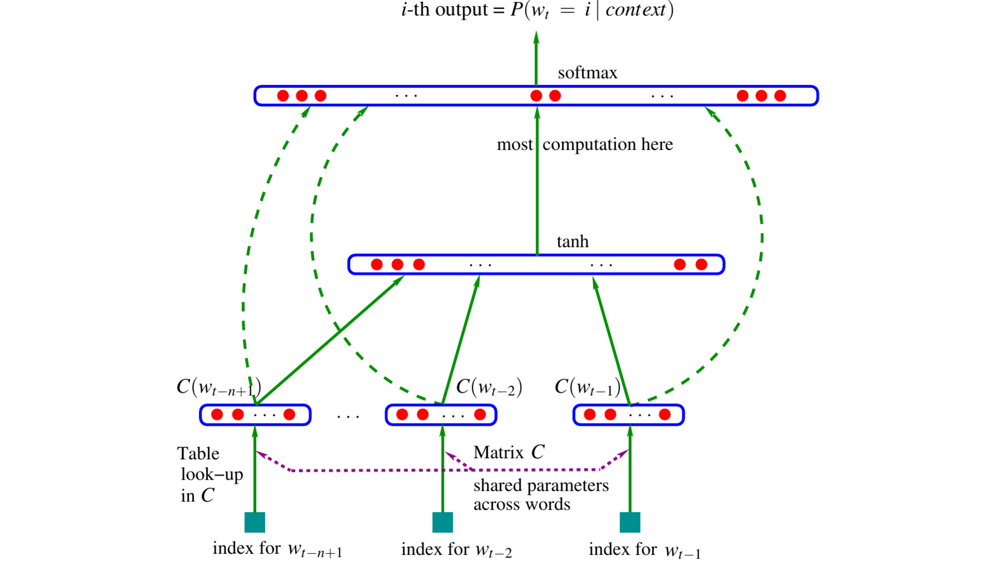

:::{.course-note-masthead .content-visible when-format="html"}


CS 351 · Introduction to Natural Language Processing  
Chapter 5 · Neural networks for sequences
:::

A fixed-window language model can use several recent words, but it cannot decide to remember an important word for an unknown amount of time. This chapter develops the machinery needed to replace that rigid window with a learned state. We will move from neural language models to recurrent computation, backpropagation through time, gated memory, and finally sequence-to-sequence learning.

{#fig-neural-sequences-overview .chapter-overview-image width=92% fig-align="center"}

```{mermaid}
%%| label: fig-neural-sequences-route
%%| fig-cap: "Each part repairs a limitation exposed by the preceding part."
%%| fig-width: 7.2
flowchart LR
    A[Fixed context] --> B[Neural LM]
    B --> C[Recurrent state]
    C --> D[BPTT]
    D --> E[Gated memory]
    E --> F[Encoder–decoder]
    F --> G[Attention?]

    classDef base fill:#e8f2f0,stroke:#0f6f78,color:#17364a
    classDef learning fill:#fff3d6,stroke:#b98a1d,color:#17364a
    classDef bridge fill:#f2e9f7,stroke:#8b5bb5,color:#17364a
    class A,B,C base
    class D,E learning
    class F,G bridge
```

:::{.callout-note}
## Learning objectives

After this chapter, you should be able to:

1. distinguish the sparsity problem from the fixed-memory problem of n-gram models;
2. construct a fixed-window neural language model from embeddings and shared parameters;
3. compute the forward equations of an RNN and interpret its hidden state;
4. explain how backpropagation through time accumulates parameter gradients;
5. diagnose vanishing and exploding gradients and apply gradient clipping;
6. compare the information paths in LSTM and GRU cells;
7. explain encoder–decoder and conditional language-model training; and
8. identify the fixed-context bottleneck that motivates attention.
:::

# The memory problem left by n-grams {#sec-fixed-memory}

The previous chapter constructed language models from counts. An n-gram model estimates a next-token distribution from a fixed suffix of the available history:

$$
P(w_t\mid w_{1:t-1})
\approx
P(w_t\mid w_{t-n+1:t-1}).
$$ {#eq-fixed-history}

This approximation is computationally useful, but it imposes a strict memory policy: **retain the most recent $n-1$ tokens and discard everything earlier**. The policy depends only on position. It cannot retain a distant word because that word is important.

## A dependency that does not fit the window {#sec-agreement-example}

Keep the following sentence visible throughout the example:

> The **keys** to the cabinet ___ on the table.

The exact task is to predict the missing verb. The plural noun *keys* determines that the correct continuation is *are*. The singular noun *cabinet* is closer to the blank, but it is not the subject.

The token sequence available before the prediction is:

| Position | 1 | 2 | 3 | 4 | 5 |
|---:|---|---|---|---|---|
| Token | the | **keys** | to | the | cabinet |
| Role | determiner | plural subject | connector | determiner | intervening noun |

: The important grammatical feature occurs at position 2, while the nearest noun occurs at position 5. {#tbl-agreement-tokens}

A bigram model retains only the final token:

$$
P(w_6\mid w_{1:5})
\approx
P(w_6\mid \text{cabinet}).
$$

The model therefore asks, “Which word often follows *cabinet*?” It cannot ask, “Which verb agrees with the subject of this clause?” The plural feature was present in the sentence, but it was discarded before prediction.

```{mermaid}
%%| label: fig-bigram-information-loss
%%| fig-cap: "The sentence contains the needed feature, but the bigram representation exposes only the final token to the predictor."
%%| fig-width: 6.8
flowchart LR
    K[keys<br/>subject = plural] --> T1[to]
    T1 --> T2[the]
    T2 --> C[cabinet]
    C --> Q[?]
    K -. needed agreement .-> Q

    classDef cue fill:#e8f2f0,stroke:#0f6f78,color:#17364a
    classDef local fill:#f8e5df,stroke:#d95f43,color:#17364a
    classDef neutral fill:#ffffff,stroke:#718387,color:#17364a
    class K cue
    class C,Q local
    class T1,T2 neutral
```

:::{.callout-important}
## Try it before reading the solution

Suppose the model is a trigram. Its retained history contains two tokens.

1. What exact history does it see before predicting the verb?
2. Does that history contain the number of the subject?
3. What minimum n-gram order would include *keys* in this particular sentence?
:::

### Worked solution

The two-token trigram history is:

```text
the cabinet
```

It still does not contain *keys*, so it does not expose the subject's plural number. The distance from *keys* to the missing verb is four token transitions:

```text
keys → to → the → cabinet → ___
```

To include *keys* when predicting the blank, the retained history must contain four tokens. That requires a **5-gram** model:

$$
P(w_6\mid w_{1:5})
\approx
P(w_6\mid w_2,w_3,w_4,w_5).
$$

For this one sentence, increasing the order repairs the missing-input problem. It does not provide a general solution: another sentence can insert five, ten, or fifty tokens between the subject and its verb.

## Why increasing the order is not learned memory {#sec-increasing-order}

Increasing $n$ changes the length of the window, not the rule used to select information. The model still retains a fixed suffix and discards the rest.

If the vocabulary contains $|V|$ tokens, an order-$n$ model may need to distinguish as many as $|V|^{n-1}$ histories and $|V|^n$ complete n-grams. For $|V|=50{,}000$,

$$
(50{,}000)^5
= 3.125\times 10^{23}
$$

possible 5-grams exist.

The number is not a claim that a system will store a dense table of that size. It exposes the combinatorial space in which observations become sparse: longer histories are more informative when repeated, but exact repetitions become less likely [@jurafsky2026slp, ch. 3].

| Order | Retained history before the blank | Contains *keys*? | General solution? |
|---|---|:---:|:---:|
| Bigram | `cabinet` | No | No |
| Trigram | `the cabinet` | No | No |
| 5-gram | `keys to the cabinet` | Yes | No |
| Larger fixed n | a longer suffix | Sometimes | No |

: A longer window can capture this dependency but cannot adapt to dependencies of unknown length. {#tbl-window-orders}

## Two limitations that should not be confused {#sec-two-limitations}

N-gram models exhibit two related but distinct failures.

### Failure 1: sparse evidence

Suppose the training corpus contains:

> the cat rested

but never contains:

> the dog rested

A count model may assign the second phrase zero probability even though *cat* and *dog* occur in similar linguistic environments. This is a **generalization problem**: the model treats different word identities as unrelated table entries.

Smoothing redistributes probability mass and prevents unseen events from receiving probability zero. However, ordinary smoothing still does not give *cat* and *dog* a learned geometric relationship.

### Failure 2: discarded evidence

In the agreement sentence, the relevant word *keys* occurred, but it fell outside the active window. This is a **memory problem**: information needed at prediction time is absent from the model input.

Smoothing cannot reconstruct a feature that the representation has already removed. The difference can be summarized as follows:

| Question | Sparse evidence | Discarded evidence |
|---|---|---|
| Was the useful information in the active representation? | Yes, but the event was rare or unseen | No |
| Typical symptom | zero or unreliable count | prediction based on the wrong local cue |
| Can smoothing help? | Yes | No |
| Needed architectural change | share evidence across similar words | carry selected information across time |

: Generalization and memory require different repairs. {#tbl-two-ngram-failures}

:::{.callout-warning}
## Common misconception

“Use a larger n” is not a mechanism for long-term memory. It is a decision to preserve a longer **fixed** suffix, with a rapidly growing and increasingly sparse context space.
:::

## Section synthesis {#sec-fixed-memory-synthesis}

An n-gram model forgets by position: once a token leaves the window, its information is unavailable. A useful sequence model should instead learn a compact representation that:

- shares statistical evidence across related words;
- is updated as each new token arrives;
- preserves information when it remains useful; and
- discards information when it no longer matters.

The first neural step will address the generalization problem by replacing symbolic word identities with learned vectors and shared parameters. It will also make the remaining memory limitation easier to see.

:::{.callout-important}
## Question leading to the next section

Can a neural language model learn that *cat* and *dog* are similar while keeping the exact inputs, vectors, and scores inspectable?
:::

# Fixed-window neural language models {#sec-fixed-window-neural-lm}

The first repair is to stop treating every word as an unrelated symbol. A neural language model learns a vector for each word and reuses a shared prediction network across every context. Words that support similar predictions can acquire similar vectors, allowing evidence to be shared across related contexts [@bengio2003neural].

## Bengio's distributed-representation argument {#sec-bengio-wager}

Consider two contexts:

```text
the cat rested
the dog rested
```

A count table stores separate entries for *cat* and *dog*. A neural model instead looks up learned embeddings

$$
\mathbf e_{\text{cat}}=C\mathbf 1_{\text{cat}},
\qquad
\mathbf e_{\text{dog}}=C\mathbf 1_{\text{dog}},
$$

where $C\in\mathbb R^{d_e\times |V|}$ is an embedding matrix and each one-hot vector selects one column. If training makes the two embeddings nearby, then a shared downstream network reacts similarly to both words.

:::{.callout-tip}
## What is being shared?

The model does not copy a probability from one sentence to another. It learns reusable features. A hidden unit that responds to “animate subject” or “plural noun” can fire for many words instead of requiring a separate count for every surface form.
:::

The original neural probabilistic language model jointly learned word vectors and the probability function that used them. Its architecture is reproduced in @fig-bengio-original for historical reference.

{#fig-bengio-original width=76% fig-align="center"}

## Building the model from inspectable objects {#sec-build-fixed-window}

Use a four-word context to predict the next word:

```text
the students opened their  →  ?
```

Let every embedding have dimension $d_e$. The model constructs four visible objects.

### 1. Look up one vector per context word

$$
\mathbf e^{(1)}=C\mathbf 1_{\text{the}},\quad
\mathbf e^{(2)}=C\mathbf 1_{\text{students}},\quad
\mathbf e^{(3)}=C\mathbf 1_{\text{opened}},\quad
\mathbf e^{(4)}=C\mathbf 1_{\text{their}}.
$$

The same matrix $C$ performs every lookup. Word identity chooses a column; position does not create a new embedding table.

### 2. Concatenate the window

$$
\mathbf x=
\begin{bmatrix}
\mathbf e^{(1)}\\
\mathbf e^{(2)}\\
\mathbf e^{(3)}\\
\mathbf e^{(4)}
\end{bmatrix}
\in\mathbb R^{4d_e}.
$$ {#eq-window-concatenation}

Concatenation preserves word order because each position occupies a different block of $mathbf x$.

### 3. Compute a hidden representation

$$
\mathbf a=W\mathbf x+\mathbf b_h,
\qquad
\mathbf h=\tanh(\mathbf a),
$$ {#eq-window-hidden}

with $W\in\mathbb R^{d_h\times 4d_e}$ and $mathbf b_h\in\mathbb R^{d_h}$.

### 4. Produce a vocabulary distribution

$$
\mathbf z=U\mathbf h+\mathbf b_o,
\qquad
\hat{\mathbf y}=\operatorname{softmax}(\mathbf z),
$$ {#eq-window-output}

where $U\in\mathbb R^{|V|\times d_h}$. The output contains one probability per vocabulary item. Plausible continuations might include *books* and *laptops*; implausible continuations remain present with low probability.

| Object | Shape | Interpretation |
|---|---:|---|
| $C$ | $d_e\times |V|$ | shared word-embedding table |
| $mathbf x$ | $4d_e$ | ordered four-word context |
| $W$ | $d_h\times4d_e$ | context-to-hidden transformation |
| $U$ | $|V|\times d_h$ | hidden-to-vocabulary transformation |
| $\hat{\mathbf y}$ | $|V|$ | next-word distribution |

: The dimensions make the fixed-window assumption visible in the parameters. {#tbl-fixed-window-shapes}

## What the neural window fixes—and what it does not {#sec-neural-window-limit}

The neural model improves generalization in two ways:

1. embeddings allow related words to share evidence; and
2. shared matrices replace a table containing one independent parameter set per observed n-gram.

The memory policy, however, remains fixed. If the window contains $k$ embeddings,

$$
\mathbf x\in\mathbb R^{kd_e},
\qquad
W\in\mathbb R^{d_h\times kd_e}.
$$

Adding one more position adds $d_hd_e$ parameters to $W$. More importantly, concatenation assigns a distinct block of $W$ to every position. The model does not apply one position-independent rule repeatedly through time.

:::{.callout-warning}
## The boundary moved; it did not disappear

A four-word neural window forgets the fifth-most-recent word just as completely as a 5-gram model. Distributed representations repair exact-match generalization, not unbounded memory.
:::

The required architecture should accept an arbitrary number of inputs while keeping its parameter shapes fixed. That requirement leads to recurrence.

# Recurrent neural networks {#sec-rnn}

A recurrent neural network (RNN) maintains a **hidden state** that is updated after every input. Instead of concatenating a separate block for every position, it applies the same transformation at each time step.

```{mermaid}
%%| label: fig-rnn-unfolded
%%| fig-cap: "Unfolding reveals repeated applications of one state-update rule. The graph grows with the sequence, but the parameter set does not."
%%| fig-width: 7.1
flowchart LR
    X1[x1] --> H1[h1]
    H0[h0] --> H1
    H1 --> H2[h2]
    X2[x2] --> H2
    H2 --> H3[h3]
    X3[x3] --> H3
    H3 --> H4[h4]
    X4[x4] --> H4
    H4 --> Y4[y4]

    classDef input fill:#f2e9f7,stroke:#8b5bb5,color:#17364a
    classDef state fill:#f8e5df,stroke:#d95f43,color:#17364a
    classDef output fill:#e8f2f0,stroke:#0f6f78,color:#17364a
    class X1,X2,X3,X4 input
    class H0,H1,H2,H3,H4 state
    class Y4 output
```

## One recurrent cell {#sec-rnn-cell}

For input $mathbf x_t\in\mathbb R^{d_x}$ and previous state $mathbf h_{t-1}\in\mathbb R^{d_h}$, a simple tanh RNN computes

$$
\begin{aligned}
\mathbf a_t &= W_x\mathbf x_t+W_h\mathbf h_{t-1}+\mathbf b_h,\\
\mathbf h_t &= \tanh(\mathbf a_t),\\
\mathbf z_t &= U\mathbf h_t+\mathbf b_o,\\
\hat{\mathbf y}_t &= \operatorname{softmax}(\mathbf z_t).
\end{aligned}
$$ {#eq-rnn-forward}

The matrices have fixed shapes:

$$
W_x\in\mathbb R^{d_h\times d_x},\quad
W_h\in\mathbb R^{d_h\times d_h},\quad
U\in\mathbb R^{|V|\times d_h}.
$$

The subscript $t$ appears on activations, not parameters. Every time step reuses $W_x$, $W_h$, $U$, and the biases.

:::{.callout-note}
## State is not a stored sentence

$\mathbf h_t$ is a learned summary produced by repeated transformations. It is not a list of previous words, and no coordinate is guaranteed to have a human-readable meaning. Training determines which aspects of the history become useful features.
:::

## A complete scalar forward pass {#sec-rnn-scalar-example}

Before working with vectors, inspect a one-dimensional RNN. Let

$$
h_t=\tanh(w_xx_t+w_hh_{t-1}+b),
$$

with

$$
w_x=0.8,\qquad w_h=0.5,\qquad b=0,\qquad h_0=0.
$$

Suppose two scalar inputs are $x_1=1$ and $x_2=-0.5$.

:::{.callout-important}
## Try it first

Compute $a_1,h_1,a_2,h_2$. Keep at least three decimal places.
:::

At the first step,

$$
a_1=0.8(1)+0.5(0)=0.8,
\qquad
h_1=\tanh(0.8)\approx0.664.
$$

At the second step, the new input and previous state meet:

$$
a_2=0.8(-0.5)+0.5(0.664)
=-0.400+0.332=-0.068,
$$

$$
h_2=\tanh(-0.068)\approx-0.068.
$$

| Step | $x_t$ | recurrent contribution $w_hh_{t-1}$ | input contribution $w_xx_t$ | $a_t$ | $h_t$ |
|---:|---:|---:|---:|---:|---:|
| 1 | 1.0 | 0.000 | 0.800 | 0.800 | 0.664 |
| 2 | −0.5 | 0.332 | −0.400 | −0.068 | −0.068 |

: The state combines new evidence with a transformed summary of earlier evidence. {#tbl-scalar-rnn-forward}

The state can continue for five or five hundred inputs without changing the number or shapes of the parameters. The price is sequential computation: $h_t$ cannot be computed until $h_{t-1}$ exists.

# Learning through time {#sec-bptt}

Training an RNN requires derivatives through the reused recurrent computation. We first derive one local backward step, then connect those steps across the unfolded sequence.

## Backpropagation through one cell {#sec-one-cell-backprop}

For a one-hot target $\mathbf y_t$, the cross-entropy loss is

$$
J^{(t)}=-\sum_{v\in V}y_{t,v}\log\hat y_{t,v}.
$$ {#eq-token-cross-entropy}

Softmax and cross-entropy simplify the derivative with respect to logits:

$$
\boldsymbol\delta_{z,t}
=\frac{\partial J^{(t)}}{\partial\mathbf z_t}
=\hat{\mathbf y}_t-\mathbf y_t.
$$ {#eq-softmax-error}

The output matrix sends that error into hidden-state space:

$$
\mathbf g_{h,t}^{\text{local}}
=U^\top\boldsymbol\delta_{z,t}.
$$

For $\mathbf h_t=\tanh(\mathbf a_t)$,

$$
\boldsymbol\delta_{a,t}
=\mathbf g_{h,t}\odot(1-\mathbf h_t\odot\mathbf h_t).
$$ {#eq-tanh-backward}

The same pre-activation error produces every parameter gradient entering the cell:

$$
\begin{aligned}
\frac{\partial J}{\partial W_x}&=\boldsymbol\delta_{a,t}\mathbf x_t^\top,\\
\frac{\partial J}{\partial W_h}&=\boldsymbol\delta_{a,t}\mathbf h_{t-1}^\top,\\
\frac{\partial J}{\partial\mathbf b_h}&=\boldsymbol\delta_{a,t},\\
\frac{\partial J}{\partial\mathbf h_{t-1}}&=W_h^\top\boldsymbol\delta_{a,t}.
\end{aligned}
$$ {#eq-rnn-local-gradients}

The final line is what makes temporal credit assignment possible: error at time $t$ becomes an error signal for the preceding state.

## One concrete token loss {#sec-token-loss-example}

After the context

```text
the students opened their
```

suppose the observed target is *books* and the model assigns

$$
\hat y_{t,\text{books}}=0.62.
$$

Because the target is one-hot, all terms in @eq-token-cross-entropy except the target entry vanish:

$$
J^{(t)}=-\log(0.62)\approx0.478.
$$

A larger probability on the correct word produces a smaller loss. The loss is attached to this output, but its gradient reaches the state, the current input path, and the preceding state.

## Multiple gradient paths add {#sec-gradient-merge}

An intermediate state $\mathbf h_t$ has at least two downstream uses:

1. it produces the current output and loss $J^{(t)}$; and
2. it influences $\mathbf h_{t+1}$ and therefore all later losses.

Backpropagation sums both contributions:

$$
\frac{\partial J}{\partial\mathbf h_t}
=
\underbrace{U^\top\boldsymbol\delta_{z,t}}_{\text{current output}}
+
\underbrace{W_h^\top\boldsymbol\delta_{a,t+1}}_{\text{future recurrence}}.
$$ {#eq-hidden-gradient-sum}

This is an application of the multivariable chain rule. Backpropagation does not choose one route through a graph; every downstream route contributes to the gradient of a shared node.

## Backpropagation through time {#sec-full-bptt}

For a sequence with $T$ supervised outputs, the total objective is often a sum or mean of token losses:

$$
J=\sum_{t=1}^{T}J^{(t)}.
$$ {#eq-sequence-loss}

Backpropagation through time (BPTT) means:

1. unfold the recurrent computation over the observed sequence;
2. compute all token losses;
3. propagate gradients backward from later states to earlier states; and
4. sum every time-step contribution to the shared parameters.

```{mermaid}
%%| label: fig-bptt-contributions
%%| fig-cap: "Each time step uses the same parameters, so its local contribution is added to one shared parameter gradient."
%%| fig-width: 7
flowchart LR
    L1[J1] --> H1[h1]
    L2[J2] --> H2[h2]
    L3[J3] --> H3[h3]
    H3 -. gradient .-> H2
    H2 -. gradient .-> H1
    H1 --> P[shared gradients]
    H2 --> P
    H3 --> P

    classDef loss fill:#f8e5df,stroke:#d95f43,color:#17364a
    classDef state fill:#ffffff,stroke:#356fa8,color:#17364a
    classDef params fill:#e8f2f0,stroke:#0f6f78,color:#17364a
    class L1,L2,L3 loss
    class H1,H2,H3 state
    class P params
```

For example,

$$
\frac{\partial J}{\partial W_h}
=\sum_{t=1}^{T}\boldsymbol\delta_{a,t}\mathbf h_{t-1}^{\top}.
$$ {#eq-shared-recurrent-gradient}

The sum reflects weight sharing: there are many uses of $W_h$, but only one parameter tensor to update.

:::{.callout-tip}
## Implementation view

Modern automatic-differentiation systems construct this unfolded computation graph dynamically or symbolically. “Run BPTT” usually means computing the forward sequence loss and calling the framework's backward operation—not manually writing every derivative.
:::

# Generating structured text with an RNN {#sec-rnn-generation}

The same recurrent mechanism can be trained at the character level. At each step, the model predicts a distribution over the next character; a sampled character is fed back as the next input. Repeating this loop generates text of arbitrary length.

{#fig-rnn-recipe width=62% fig-align="center"}

A recipe corpus contains highly visible regularities: titles, quantities, ingredient lists, numbered actions, punctuation, and recurring verbs. An RNN can learn these surface patterns even when its generated content is incoherent.

```text
PINEAPPLE COCOA PASTA

1 cup pasta
2 tbsp cocoa powder
1 cup pineapple chunks
...

Mix until the sauce remembers the oven.
```

The sample looks recipe-like because the model has learned local and medium-range form. That appearance does not imply physical consistency, factuality, or safety. The historical recipe-generation example provides a useful seed for the coding project: inspect generated structure, then trace how temperature and sampling decisions affect output [the original demonstration is available here](https://gist.github.com/nylki/1efbaa36635956d35bcc).

# Why gradients vanish or explode {#sec-gradient-instability}

Long-range learning requires a gradient to cross many recurrent transitions. Repeated multiplication is the central difficulty.

## The repeated Jacobian product {#sec-jacobian-product}

For the simple RNN,

$$
\frac{\partial\mathbf h_t}{\partial\mathbf h_{t-1}}
=D_tW_h,
$$

where

$$
D_t=\operatorname{diag}(1-\mathbf h_t\odot\mathbf h_t)
$$

contains derivatives of tanh. A gradient traveling from time $T$ to time $0$ contains

$$
\frac{\partial\mathbf h_T}{\partial\mathbf h_0}
=\prod_{t=1}^{T}D_tW_h.
$$ {#eq-rnn-jacobian-product}

If these local transformations repeatedly contract the signal, the gradient vanishes. If they repeatedly expand it, the gradient explodes [@bengio1994learning; @pascanu2013difficulty].

## A scalar calculation {#sec-gradient-scalar}

The matrix case changes different directions by different amounts, but a scalar chain exposes the basic behavior.

:::{.callout-important}
## Try it first

A loss gradient has magnitude $1$ at the final state and crosses four identical local derivatives.

1. What reaches the first state if every derivative is $0.6$?
2. What reaches it if every derivative is $1.5$?
:::

For the contracting case,

$$
1\times0.6^4=0.1296.
$$

The successive magnitudes are

```text
1.000 → 0.600 → 0.360 → 0.216 → 0.1296
```

For the expanding case,

$$
1\times1.5^4=5.0625,
$$

with

```text
1.000 → 1.500 → 2.250 → 3.375 → 5.0625
```

| Behavior | Training consequence |
|---|---|
| Vanishing gradient | early states receive almost no learning signal from distant losses |
| Exploding gradient | updates become unstable and may overflow numerically |

: Both behaviors arise from repeated local transformations, not from sequence length alone. {#tbl-gradient-consequences}

## Gradient clipping: a practical guardrail {#sec-gradient-clipping}

Clipping by global norm caps an excessively large gradient while preserving its direction. Given gradient vector $mathbf g$ and threshold $\tau$,

$$
\widetilde{\mathbf g}
=\min\left(1,\frac{\tau}{\lVert\mathbf g\rVert_2}\right)\mathbf g.
$$ {#eq-gradient-clipping}

If $\lVert\mathbf g\rVert_2=18$ and $\tau=5$,

$$
\widetilde{\mathbf g}=\frac{5}{18}\mathbf g,
\qquad
\lVert\widetilde{\mathbf g}\rVert_2=5.
$$

Every component is multiplied by the same positive scalar, so the direction is unchanged.

```python
def clip_by_global_norm(gradient, threshold):
    norm = gradient.norm(p=2)
    if norm > threshold:
        gradient = (threshold / norm) * gradient
    return gradient
```

:::{.callout-warning}
## What clipping does not solve

Clipping controls explosions. It cannot restore a long-range gradient that has already faded toward zero. A more structural solution must provide a less distorted route for information and credit.
:::

# Gated recurrent cells {#sec-gated-cells}

LSTM and GRU cells add learned gates that control how much old information is retained and how much new information is written. LSTM was introduced in 1997, GRU in 2014, and gated RNNs became especially prominent during roughly 2012–2018 [@hochreiter1997lstm; @cho2014gru]. The Transformer appeared in 2017; replacement of recurrent models was gradual and task-dependent [@vaswani2017attention].

Gates use the logistic sigmoid

$$
\sigma(a)=\frac{1}{1+e^{-a}},
$$

whose output lies between $0$ and $1$. Elementwise multiplication by a gate therefore behaves like a learned soft control: values near $0$ suppress a component, while values near $1$ preserve it.

## LSTM: retain, write, expose {#sec-lstm}

An LSTM separates the cell state $\mathbf c_t$ from the visible hidden state $\mathbf h_t$.

### Retain or forget

$$
\mathbf f_t
=\sigma\!\left(W_f[\mathbf h_{t-1};\mathbf x_t]+\mathbf b_f\right).
$$

$\mathbf f_t\odot\mathbf c_{t-1}$ selects how much previous memory survives.

### Prepare a write

$$
\begin{aligned}
\mathbf i_t&=\sigma\!\left(W_i[\mathbf h_{t-1};\mathbf x_t]+\mathbf b_i\right),\\
\mathbf g_t&=\tanh\!\left(W_g[\mathbf h_{t-1};\mathbf x_t]+\mathbf b_g\right).
\end{aligned}
$$

$\mathbf i_t$ controls write strength; $\mathbf g_t$ proposes candidate content.

### Update memory additively

$$
\mathbf c_t
=\mathbf f_t\odot\mathbf c_{t-1}
+\mathbf i_t\odot\mathbf g_t.
$$ {#eq-lstm-cell-update}

The additive path is the key structural change. When $\mathbf f_t$ remains near $1$ and the write term remains small, information and gradient can travel through the cell state with less repeated distortion.

### Expose part of memory

$$
\begin{aligned}
\mathbf o_t&=\sigma\!\left(W_o[\mathbf h_{t-1};\mathbf x_t]+\mathbf b_o\right),\\
\mathbf h_t&=\mathbf o_t\odot\tanh(\mathbf c_t).
\end{aligned}
$$

The output gate controls which parts of memory become visible to predictions and the next recurrent step.

## GRU: reset, propose, interpolate {#sec-gru}

A GRU combines memory and visible state into one vector. It uses two main gates.

### Reset the old state before proposing a candidate

$$
\mathbf r_t
=\sigma\!\left(W_r[\mathbf h_{t-1};\mathbf x_t]+\mathbf b_r\right),
$$

$$
\widetilde{\mathbf h}_t
=\tanh\!\left(W_h[\mathbf r_t\odot\mathbf h_{t-1};\mathbf x_t]+\mathbf b_h\right).
$$

### Interpolate between old and proposed state

$$
\mathbf z_t
=\sigma\!\left(W_z[\mathbf h_{t-1};\mathbf x_t]+\mathbf b_z\right),
$$

$$
\mathbf h_t
=(1-\mathbf z_t)\odot\mathbf h_{t-1}
+\mathbf z_t\odot\widetilde{\mathbf h}_t.
$$ {#eq-gru-update}

The update is a learned elementwise mixture. A small component of $\mathbf z_t$ keeps the corresponding old-state component; a large value replaces it with the candidate.

| Property | LSTM | GRU |
|---|---|---|
| Persistent representation | cell state $\mathbf c_t$ plus hidden state $\mathbf h_t$ | hidden state $\mathbf h_t$ only |
| Main controls | forget, input, output | reset, update |
| State update | additive retain + write | interpolation between old and candidate |
| Typical advantage | explicit memory highway | simpler gated computation |

: Both architectures create learned paths that can preserve information; neither guarantees that every long dependency will be learned. {#tbl-lstm-gru}

:::{.callout-tip}
## Coding perspective

Libraries expose LSTM and GRU modules because the internal equations are reused at every time step. In implementation, inspect tensor shapes, initial states, returned sequences, and padding masks rather than reimplementing every gate unless the exercise explicitly asks for it.
:::

# Neural machine translation {#sec-nmt}

**Machine translation (MT)** generates a sentence in a target language that preserves the meaning of a source sentence. For example,

```text
SOURCE · French   Le colis arrivera demain.
TARGET · English  The package will arrive tomorrow.
```

The task is not word substitution. The output must express the source meaning while obeying the grammar and word order of the target language.

Google's 2016 Neural Machine Translation system was a major production-scale turning point: an end-to-end neural system replaced the previous phrase-based pipeline for deployed translation [@wu2016gnmt]. This was not the invention of neural MT, but it made the transition visible at global scale. Translation is now embedded in messaging, web access, search, meetings, captions, travel, and support systems.

## Encoder–decoder recurrence {#sec-encoder-decoder}

An encoder reads the source sequence and updates a state:

$$
\mathbf h_t^{\text{enc}}
=f_{\text{enc}}(\mathbf x_t,\mathbf h_{t-1}^{\text{enc}}).
$$

After the final source token, the last encoder state becomes a context vector:

$$
\mathbf c=\mathbf h_{T_x}^{\text{enc}}.
$$ {#eq-fixed-context}

The decoder starts from that context and generates the target sequence:

$$
\mathbf s_t
=f_{\text{dec}}(\mathbf e(y_{t-1}),\mathbf s_{t-1},\mathbf c),
$$

$$
P(y_t\mid y_{<t},\mathbf x)
=\operatorname{softmax}(U\mathbf s_t+\mathbf b).
$$

```{mermaid}
%%| label: fig-encoder-decoder
%%| fig-cap: "The final encoder state initializes a decoder that generates a new sequence. Encoder and decoder may have separate parameters."
%%| fig-width: 7.2
flowchart LR
    F1[Le] --> E1[h1]
    E1 --> E2[h2]
    F2[colis] --> E2
    E2 --> E3[h3]
    F3[arrivera] --> E3
    E3 --> E4[h4]
    F4[demain] --> E4
    E4 --> C[context c]
    C --> D1[s1]
    D1 --> D2[s2]
    D2 --> D3[s3]
    D3 --> D4[s4]
    D1 --> Y1[The]
    D2 --> Y2[package]
    D3 --> Y3[will arrive]
    D4 --> Y4[tomorrow]

    classDef source fill:#e8f2f0,stroke:#356fa8,color:#17364a
    classDef context fill:#f2e9f7,stroke:#8b5bb5,color:#17364a
    classDef target fill:#f8e5df,stroke:#d95f43,color:#17364a
    class F1,F2,F3,F4,E1,E2,E3,E4 source
    class C context
    class D1,D2,D3,D4,Y1,Y2,Y3,Y4 target
```

The source and target may have different lengths. The architecture defines two roles—reading and writing—not a requirement that one parameter matrix perform both roles [@sutskever2014sequence; @cho2014gru].

# Conditional language models {#sec-conditional-lm}

Translation is one instance of a broader encoder–decoder pattern:

$$
\text{encode input }x
\quad\longrightarrow\quad
\text{generate output }y.
$$

The interpretation of $x$ and $y$ defines the task.

| Task | Input $x$ | Generated output $y$ | Representative work |
|---|---|---|---|
| Summarization | document | shorter meaning-preserving summary | @rush2015summarization |
| Dialogue | conversation history | next response | @vinyals2015conversation |
| Parsing as generation | sentence | linearized syntax tree | @vinyals2015grammar |
| Code generation | natural-language specification | program | @yin2017code |

: The same conditional-generation abstraction supports different input and output spaces. {#tbl-conditional-tasks}

For parsing, the qualification matters: a parser becomes a conditional language model when its structure is represented as a sequence of output tokens. Not every parsing architecture is autoregressive.

These systems are called **conditional language models** because they factorize an output sequence autoregressively while conditioning every prediction on $x$:

$$
P(\mathbf y\mid\mathbf x)
=\prod_{t=1}^{T_y}
P(y_t\mid y_{<t},\mathbf x).
$$ {#eq-conditional-lm}

It is a **language model** because it predicts $y$ token by token. It is **conditional** because the input $\mathbf x$ remains part of every next-token distribution.

## Training seq2seq end to end {#sec-seq2seq-training}

During supervised training, each target token provides a decoder-side cross-entropy loss:

$$
J^{(t)}
=-\log P(y_t\mid y_{<t},\mathbf x).
$$

The sequence loss is

$$
J=\sum_{t=1}^{T_y}J^{(t)}.
$$ {#eq-seq2seq-loss}

No token-level translation loss is attached directly to encoder states. Nevertheless, backpropagation follows the full computation graph:

$$
J
\longrightarrow
\text{decoder states}
\longrightarrow
\mathbf c
\longrightarrow
\text{encoder states and parameters}.
$$

Thus, **loss location** and **update reach** are different questions:

- losses are computed where target tokens are predicted;
- decoder parameters receive direct downstream credit;
- the context path receives gradient from the decoder; and
- encoder parameters are updated because they produced the context on which every decoder prediction depends.

:::{.callout-note}
## Teacher forcing

During basic training, the decoder commonly receives the observed previous target token $y_{t-1}$ rather than its own sampled prediction. This makes all target-side losses computable in parallel across the unrolled training graph, although recurrent states themselves remain sequential. At inference time, the true next tokens are unavailable, so generated tokens must be fed back.
:::

# The fixed-context bottleneck {#sec-context-bottleneck}

The early encoder–decoder design forces the entire source through one fixed-size vector:

$$
\mathbf x_{1:T_x}
\longrightarrow
\boxed{\mathbf c}
\longrightarrow
\mathbf y_{1:T_y}.
$$

For a short sentence, this may work well. As the source becomes longer or information-rich, $\mathbf c$ must preserve every detail that any later decoder step might require. The decoder cannot return to a particular source state; it can consult only the compressed summary.

:::{.callout-important}
## The limitation

The decoder may need one specific source detail, but the architecture requires all details to compete for representation inside the same fixed-size context vector.
:::

This bottleneck motivates the next chapter. Attention was introduced in neural machine translation to let generation depend on source information more selectively [@bahdanau2015align]. We stop before its mechanism.

## Chapter synthesis {#sec-chapter-synthesis}

The chapter followed a sequence of architectural repairs:

| Limitation | Repair | Remaining question |
|---|---|---|
| exact n-gram counts do not share evidence | embeddings and shared neural parameters | how can context length vary? |
| fixed neural window grows with position count | recurrent state and weight sharing | how does distant credit survive? |
| repeated recurrent Jacobians vanish or explode | clipping and gated cells | how should one sequence condition another? |
| one fixed context summarizes the source | encoder–decoder conditional LM | how can the decoder retrieve specific source information? |

: Each repair solves one problem while exposing the next. {#tbl-chapter-repairs}

An RNN replaces a fixed input window with a learned state. BPTT trains that state across time, but repeated transformations make long-range credit fragile. LSTM and GRU cells create gated, partly additive routes for information. Encoder–decoder models then turn recurrence into a general conditional-generation framework. Their fixed-context bottleneck leaves one question for the next chapter.

:::{.callout-important}
## Carry this question forward

Can a decoder retrieve the relevant source information at each output step instead of demanding that one vector remember everything?
:::

## References

::: {#refs}
:::
